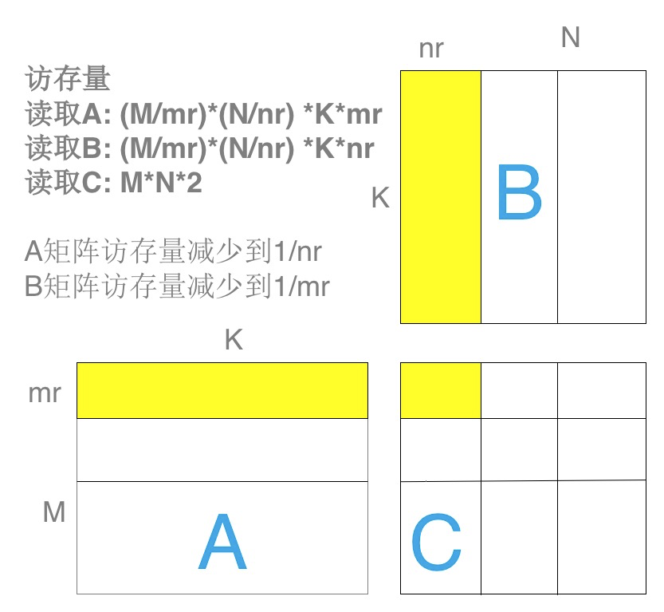
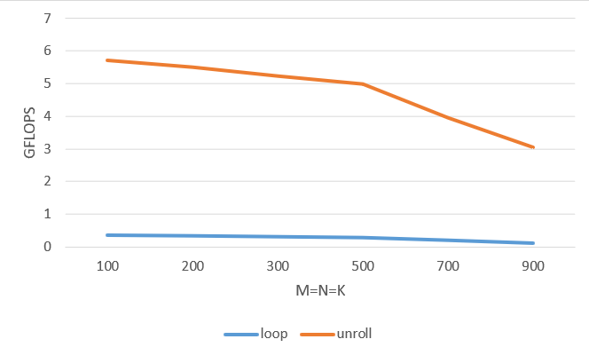
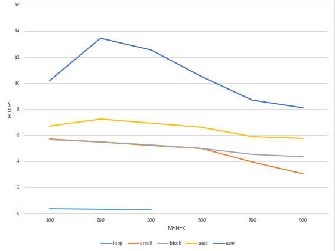

# 借助mperf进行矩阵乘法极致优化
## 前言
单精度矩阵乘法（SGEMM）是非常典型的计算密集型算子，对SGEMM的优化也经常被当作算子优化从业人员的练手项目。本文将借助于mperf在ARM A55 cpu核心上对SGEMM的性能进行极致优化，过程中会展示mperf辅助性能优化工作的基本逻辑。希望本文的读者对计算机体系结构的基础概念有一定了解，有算子优化经验更好，另外可以补充一些[TMA](https://www.intel.com/content/www/us/en/develop/documentation/vtune-cookbook/top/methodologies/top-down-microarchitecture-analysis-method.html#top-down-microarchitecture-analysis-method_GUID-FA8F07A1-3590-4A91-864D-CE96456F84D7)的基础概念。  
本文的计算目标是C=A\*B，假设矩阵A大小为M\*K，矩阵B大小为K\*N，则得到矩阵C大小为M\*N。为了后文分块操作的方便，这里假设M，N是4的倍数，并选择M=N=K分别为100，200，300，500，700，900的矩阵尺寸进行性能测试。

## 矩阵乘法优化手段
### 寄存器和FPU优化——Naive实现到循环展开
矩阵乘法的Naive实现为三层循环计算：
```
//lda：number of columns of A 
//ldb：number of columns of B
//ldc：number of columns of C 
#define A(i, j) a[(i)*lda + (j)]
#define B(i, j) b[(i)*ldb + (j)]
#define C(i, j) c[(i)*ldc + (j)]
void my_matmul_naive(int m, int n, int k, float* a, int lda, float* b, int ldb,
              float* c, int ldc) {
    int i, j, p;
    for (i = 0; i < m; i++) {         
        for (j = 0; j < n; j++) {     
            for (p = 0; p < k; p++) { 
                C(i, j) = C(i, j) + A(i, p) * B(p, j);
            }
        }
    }
}
```
此时在M=N=K分别为100，200，300时的mperf性能数据见<a href="#jump_naive">Naive_mperf</a>  
测试命令：
```
./android_build.sh -m arm64-v8a
copy build_dir/apps/arm_cpu_matmul_naive to your android platform, and run it
```

从上面链接的mperf数据可以看到 Naive 实现的 GFLOPS甚至不到0.5，而mperf在ARM A55平台实测的峰值浮点算力可以达到14GFLOPs，显然我们还有很长的路要走。分析TMA L1的数据，也即比较 Frontend_Bound、Bad_Speculation、Backend_Bound 和Retiring 的占比，可以发现占比最高的为Backend_Bound，约为50%，据此可以判断 Naive 版本的性能瓶颈在处理器后端。进一步看TMA L2及以上级别的分析数据，发现Backend_Bound中占比最大的是[Core_Bound](#术语表)，而[Interlock_Bound](#术语表)又占Core_Bound的95%以上，[Interlock_FPU](#术语表)又几乎占Interlock_Bound的100%，由此得到当前的优化方向，即降低Interlock_FPU，说明浮点计算单元触发了大量因为数据依赖而引发的pipeline stall。除此之外，我们还观察到[FPU_Util](#术语表)为0，因为此时没有进行向量化计算，说明了 Naive 实现未能充分利用处理器的SIMD单元。

早期我们通过下方的简单例子证明了，循环展开可以有效提高FPU_Util，展示如下:

```
#define UNROLL_RAW1(cb, v0, a...) \
    cb(0, ##a) 
#define UNROLL_RAW2(cb, v0, a...) \
    cb(0, ##a) cb(1, ##a) 
#define UNROLL_RAW5(cb, v0, a...) \
    cb(0, ##a) cb(1, ##a) cb(2, ##a) cb(3, ##a) cb(4, ##a)
#define UNROLL_RAW10(cb, v0, a...) \
    UNROLL_RAW5(cb, v0, ##a)       \
    cb(5, ##a) cb(6, ##a) cb(7, ##a) cb(8, ##a) cb(9, ##a)
#define UNROLL_RAW20(cb, v0, a...)                                          \
    UNROLL_RAW10(cb, v0, ##a)                                               \
    cb(10, ##a) cb(11, ##a) cb(12, ##a) cb(13, ##a) cb(14, ##a) cb(15, ##a) \
            cb(16, ##a) cb(17, ##a) cb(18, ##a) cb(19, ##a)
#define UNROLL_CALL0(step, cb, v...) UNROLL_RAW##step(cb, 0, ##v)
#define UNROLL_CALL(step, cb, v...) UNROLL_CALL0(step, cb, ##v)
#define THROUGHPUT(cb, func, UNROLL_NUM)                                      \
    static int func##_throughput_##UNROLL_NUM() {                             \
        asm volatile(                                                       \
        UNROLL_CALL(UNROLL_NUM, eor)                                                \
        "mov x0, %x[RUNS]\n"                                                \
        "1:\n"                                                              \
        UNROLL_CALL(UNROLL_NUM, cb)                                                 \
        "subs  x0, x0, #1 \n"                                               \
        "bne 1b \n"                                                         \
        :                                                                   \
        : [RUNS] "r"(mperf::RUNS)                                         \
        : "cc", "v0", "v1", "v2", "v3", "v4", "v5", "v6", "v7", "v8", "v9", \
          "v10", "v11", "v12", "v13", "v14", "v15", "v16", "v17", "v18",    \
          "v19", "x0"); \
        return mperf::RUNS * UNROLL_NUM;                                      \
    }
#define cb(i) "fmla v" #i ".4s, v" #i ".4s, v" #i ".4s\n"
THROUGHPUT(cb, fmla, 20)
THROUGHPUT(cb, fmla, 10)
THROUGHPUT(cb, fmla, 5)
THROUGHPUT(cb, fmla, 2)
THROUGHPUT(cb, fmla, 1)
```

在这个例子中，分别对不进行循环展开和以粒度为2、5、10、20的循环展开进行fmla计算，测试结果如下：

| UNROLL_NUM:20                   | UNROLL_NUM:10                  | UNROLL_NUM:5                   | UNROLL_NUM:2                   | UNROLL_NUM:1                   |
|---------------------------------|--------------------------------|--------------------------------|--------------------------------|--------------------------------|
| Interlock_FPU : 0.02681         | Interlock_FPU : 0.02519        | Interlock_FPU : 0.02236        | Interlock_FPU : 0.25727        | Interlock_FPU : 0.49998        |
| Metric_GFLOPs_Use : 14.74720    | Metric_GFLOPs_Use : 14.12275   | Metric_GFLOPs_Use : 12.97569   | Metric_GFLOPs_Use : 7.88556    | Metric_GFLOPs_Use : 3.98409    |

通过这个简单的例子我们可以看到，在循环展开的粒度较小时，增大循环展开的粒度可以显著降低Interlock_FPU。这是因为没有循环展开或循环展开特别小的时候，上一次循环还没有执行完成，下一次循环又要读取相同的寄存器，进而造成寄存器依赖。要消除寄存器依赖，首先要保证循环体中不同条指令使用不同的寄存器，并且要保证循环体内指令的条数大于该指令 latency 和该指令的 throughput 的乘积。以本文在a55平台测试fmla 向量计算为例，fmla的latency为4个cycle，并且a55处理器后端只有一个port可以执行fmla向量计算，所以fmla的throughput为1，也即要求循环体指令数大于 4 * 1 才可以解除寄存器依赖，这也符合上述试验结果的变化情况。  

在这个测试样例的启发下，我们考虑在 Naive 版本上进行循环展开：在循环最内层采用 8\*12 展开，对剩余的行采用 4\*12 展开，再对剩余的列先采用 8\*4 展开，最后用 4\*4 展开。  

这里选择8\*12是为了更充分的利用寄存器资源，因为ARM A55上面有32个128 bit向量寄存器，以及考虑到本文最后matmul汇编版本的最内层实现大体如下：
* 从A矩阵读8个float到2个向量寄存器，此时应该是8行里面每行的第一个数。
* 从B矩阵读12个float到3个向量寄存器，应该是12列里每列的第一个数。
* 用fmla指令，让B的每个float分别乘以A的两个向量寄存器（注意这里使用的外积计算矩阵乘），产生24个向量结果，也全部存储在寄存器中(24个向量寄存器存储8x12=96个中间结果）。

采用 8\*12 展开之后的代码如下：
```
void my_matmul_unroll(int m, int n, int k, float* a, int lda, float* b, int ldb,
              float* c, int ldc) {
    int i, j;

    for (j = 0; j < n;
         j += 12) { 
        if (j + 12 > n)
            break;
        for (i = 0; i < m; i += 8) { 
            if (i + 8 > m)
                break;
            AddDot8x12(k, &A(i, 0), lda, &B(0, j), ldb, &C(i, j), ldc);
        }
        if (i != m) {
            AddDot4x12(k, &A(i, 0), lda, &B(0, j), ldb, &C(i, j), ldc);
        }
    }
    if (j != n) {
        for (; j < n; j += 4) {
            for (i = 0; i < m; i += 8) { 
                if (i + 8 > m)
                    break;
                AddDot8x4(k, &A(i, 0), lda, &B(0, j), ldb, &C(i, j), ldc);
            }
            if (i != m) {
                AddDot4x4(k, &A(i, 0), lda, &B(0, j), ldb, &C(i, j), ldc);
            }
        }
    }
}

```
关于循环展开，可以用一个图来直观地理解，这里mr=8，nr=12，我们每次用A矩阵的8 \* K的小块和B矩阵的K \* 12小块来计算C的一个8 \* 12小块：  
<p align="center">
  
</p>

循环展开后的结果为<a href="#jump_unroll">Unroll_mperf</a>

对比M，N，K较小时(注: 在优化寄存器和FPU单元利用率的时候可以把问题规模先限制得比较小，减少访存issue的干扰)循环展开与Naive算法的Interlock_FPU、FPU_Util和GFLOPS：
| loop                           | unroll                         | loop                           | unroll                         | loop                           | unroll                         |
|--------------------------------|--------------------------------|--------------------------------|--------------------------------|--------------------------------|--------------------------------|
| M=N=K=100                      | M=N=K=100                      | M=N=K=200                      | M=N=K=200                      | M=N=K=300                      | M=N=K=300                      |
| Interlock_FPU :    0.41489     | Interlock_FPU :    0.11604     | Interlock_FPU :    0.39121     | Interlock_FPU :    0.11293     | Interlock_FPU :    0.34547     | Interlock_FPU :    0.11227     |
| Metric_FPU_Util :    0.00000   | Metric_FPU_Util :    0.35740   | Metric_FPU_Util :    0.00000   | Metric_FPU_Util :    0.34510   | Metric_FPU_Util :    0.00000   | Metric_FPU_Util :    0.33232   |
| Metric_GFLOPs_Use :    0.36511 | Metric_GFLOPs_Use :    5.73161 | Metric_GFLOPs_Use :    0.34685 | Metric_GFLOPs_Use :    5.50208 | Metric_GFLOPs_Use :    0.30557 | Metric_GFLOPs_Use :    5.24582 |

可以看到循环展开后可以看到Interlock_FPU占比下降明显，同时FPU_util明显上升，GFLOPS有数量级的上升，说明充分利用寄存器资源和提高FPU利用率对提高程序性能有很大帮助。
<p align="center">
  
</p>

### 访存优化——分块和PACK
上图是 unroll 版本与 Naive 版本在不同矩阵尺寸下的性能对比，可以看到循环展开后GFLOPS在矩阵比较小的性能提升还是很明显，原先上文已经分析过了，但是随着矩阵尺寸增大unroll的效果迅速下降。所以现在我们将注意力转移到，如何解决矩阵尺寸增大性能下降的问题。通过分析上节链接的unroll版本的mperf数据，可以看到，随着矩阵尺寸变大到一定程度，Memory_Bound占比逐渐接近50%，替代之前的Interlock_FPU成为新的性能瓶颈。而Memory_Bound占比高主要是[Load_Cache](#术语表)造成的，这就指导我们接下来需要进行访存相关的优化。

#### 分块
之所以矩阵尺寸增加，unroll版本的性能会下降，主要原因就是数据无法全部驻留在Cache中，导致数据频繁地在Cache和主存之间换入换出。为了减少对主存的重复访存操作，首先我们能想到的就是分块(unroll 版本的提到的分块是内层分块，目的是优化寄存器和FPU的利用率，请注意区别)，将分块之后的数据保存在Cache中。     

这里我们选择对N，K维分别进行Nr和Kr粒度的分块，结合循环展开部分的逻辑，整体的分块方式即为：外层选取A矩阵的M\*Kr小块和B矩阵的Kr\*Nr小块，内层再对这两个小块分别进行mr行和nr列的划分，所以最终内层每次计算mr\*Kr的A小块和Kr\*nr的B小块，得到C矩阵mr\*nr小块的部分中间结果。  

关于如何确定Nr和Kr的大小，我们的目标就是使得计算时需要用到的分块可以根据访存频繁的程度保存在CPU的各级存储中，原则就是访问越频繁的分块存储在速度越快的存储上，以及保证优先用满速度快的存储资源之后再下溢。针对matmul, 具体约束条件设定为：  
* 将重复访存率最高的mr\*nr大小的C小块保存在访存速度最快的寄存器上(unroll版本就是这样假设的)。
* 将下图中红色部分(包括计算完一个mr\*Nr的C行块需要重复访问次数最多的mr\* Kr的A行块，内层一次计算迭代需要用到的Kr\*nr大小的B列块)都保存在L1中。
* 由于计算完每一个mr\*Nr的C行块，都需要重复遍历一次整个Kr\*Nr大小的B块，因此希望将Kr\*Nr大小的B块存放在L2中，使得每次读取Kr\*nr的B列块的时候，都是从L2中读取。  
<p align="center">
  
</p>

依据上面的分配策略，并结合CPU中的各级存储资源(寄存器数量，L1D和L2)的尺寸，便可以确定最佳的Nr，Kr取值：
* 可以根据CPU处理器的寄存器数量得到mr和nr的具体大小，寄存器容量> mr\*nr (unroll版本就是遵循这个约束条件取的mr=8,nr=12)
* 根据L1D Cache的大小结合mr和nr计算出Kr，Kr=L1D/(mr+nr)
* 再根据L2的大小计算出B矩阵中的Nr，Nr=(L2-L1D)/Kr  

在ARM A55上，最终得到的Nr为252，Kr为256。注意：这里计算得到Nr为256，但是由于我们选择nr为12，因此为了避免不必要的余数处理，选择Nr为12的倍数简化问题。  

Kr/Nr分块的代码逻辑如下：
```
#define kc 256
#define nc 252
void my_mamtmul_block(int m, int n, int k, float *a, int lda, float *b, int ldb,
              float *c, int ldc) {
  int j, p, pb, ib;
  for (p = 0; p < k; p += kc) {
    pb = min(k - p, kc);
    for (j = 0; j < n; j += nc) {
      ib = min(n - j, nc);
      InnerKernel(m, ib, pb, &A(0, p), lda, &B(p, j), ldb, &C(0, j), ldc);
    }
  }
}
```
添加Kr/Nr分块后的mperf性能数据见<a href="#jump_block">Block_mperf</a>

对比Kr/Nr分块前后以下变化明显的数据：
| unroll                                | block                                 | unroll                                | block                                 |
|---------------------------------------|---------------------------------------|---------------------------------------|---------------------------------------|
| M=N=K=700                             | M=N=K=700                             | M=N=K=900                             | M=N=K=900                             |
| Memory_Bound :    0.31008             | Memory_Bound :    0.23551             | Memory_Bound :    0.48435             | Memory_Bound :    0.25875             |
| Load_Bound :    0.31003               | Load_Bound :    0.23547               | Load_Bound :    0.48433               | Load_Bound :    0.25870               |
|  Load_DTLB :    0.01087               |  Load_DTLB :    0.01252               |  Load_DTLB :    0.01226               |  Load_DTLB :    0.02023               |
| Load_Cache :    0.30802               | Load_Cache :    0.21025               | Load_Cache :    0.45685               | Load_Cache :    0.23244               |
| Store_Bound :    0.00005              | Store_Bound :    0.00004              | Store_Bound :    0.00002              | Store_Bound :    0.00005              |
|  Store_TLB :    0.00003               |  Store_TLB :    0.00010               |  Store_TLB :    0.00002               |  Store_TLB :    0.00004               |
| Store_Buffer :    0.00001             | Store_Buffer :    0.00001             | Store_Buffer :    0.00000             | Store_Buffer :    0.00001             |
| Metric_L1D_Miss_Ratio :    0.03458    | Metric_L1D_Miss_Ratio :    0.01878    | Metric_L1D_Miss_Ratio :    0.03515    | Metric_L1D_Miss_Ratio :    0.02113    |
| Metric_L1D_RD_Miss_Ratio :    0.03581 | Metric_L1D_RD_Miss_Ratio :    0.02030 | Metric_L1D_RD_Miss_Ratio :    0.03639 | Metric_L1D_RD_Miss_Ratio :    0.02284 |
| Metric_L1D_WR_Miss_Ratio :    0.00379 | Metric_L1D_WR_Miss_Ratio :    0.00169 | Metric_L1D_WR_Miss_Ratio :    0.00390 | Metric_L1D_WR_Miss_Ratio :    0.00189 |
| Metric_L2D_Miss_Ratio :    0.15673    | Metric_L2D_Miss_Ratio :    0.26215    | Metric_L2D_Miss_Ratio :    0.18801    | Metric_L2D_Miss_Ratio :    0.23144    |
| Metric_L2D_RD_Miss_Ratio :    0.31396 | Metric_L2D_RD_Miss_Ratio :    0.52642 | Metric_L2D_RD_Miss_Ratio :    0.37706 | Metric_L2D_RD_Miss_Ratio :    0.46396 |
| Metric_L2D_WR_Miss_Ratio :    0.00000 | Metric_L2D_WR_Miss_Ratio :    0.00000 | Metric_L2D_WR_Miss_Ratio :    0.00000 | Metric_L2D_WR_Miss_Ratio :    0.00000 |
| Metric_L3D_Miss_Ratio :    0.18870    | Metric_L3D_Miss_Ratio :    0.05405    | Metric_L3D_Miss_Ratio :    0.23623    | Metric_L3D_Miss_Ratio :    0.05183    |
| Metric_L3D_RD_Miss_Ratio :    0.38055 | Metric_L3D_RD_Miss_Ratio :    0.10890 | Metric_L3D_RD_Miss_Ratio :    0.47494 | Metric_L3D_RD_Miss_Ratio :    0.10425 |
| Metric_Load_Port_Util :    0.12046    | Metric_Load_Port_Util :    0.13779    | Metric_Load_Port_Util :    0.09069    | Metric_Load_Port_Util :    0.13191    |
| Metric_Store_Port_Util :    0.07090   | Metric_Store_Port_Util :    0.08126   | Metric_Store_Port_Util :    0.05370   | Metric_Store_Port_Util :    0.07829   |
| Metric_GFLOPs_Use :    3.95044        | Metric_GFLOPs_Use :    4.53463        | Metric_GFLOPs_Use :    3.03964        | Metric_GFLOPs_Use :    4.37174        |

Kr/Nr分块后可以看到在矩阵较大时进行快速矩阵乘法，GFLOPS确实上升不少，Load_Cache和[Metric_L3D_RD_Miss_Ratio](#术语表)等均有明显下降。这说明Kr/Nr分块确实大幅减少了对latency非常大的系统主存的访问，优化了程序的访存性能。

#### 数据PACK

分析Kr/Nr分块后测得的mperf数据，可以看到随着矩阵尺寸变大，性能也能保持相对稳定，没有明显下降。但是此时TMA相关参数显示，Backend_Bound中的Memory_Bound占比依旧很高，性能瓶颈还是停留在访存部分。

进一步思考，在上面计算每个mr\*nr大小的C小块的时候，每一次迭代都需要读取A矩阵mr\*1的数据，而本文测试的矩阵数据都是行主序，所以每行数据之间内存不连续，因此这样访问依旧对Cache不友好。同样在不同迭代中，需要读取矩阵B中不同行的1\*nr的数据，也存在数据读取不连续的情况。考虑到分块计算matmul的逻辑下，A的所有行块和B中的所有列块将被读取多次，因此可以通过对A和B提前进行数据PACK，这样只在第一次PACK时候对Cache不友好，后面计算时候频繁多次访问时数据都是连续访存，因此收益巨大。   
下图说明了对A/B矩阵分别PACK的过程：

```
void InnerKernel(int m, int n, int k, float* a, int lda, float* b, int ldb,
                 float* c, int ldc) {
    int i, j;
    float packedA[m * k];
    float packedB[k * n];

    for (j = 0; j < n; j += 12) {
        if (j + 12 > n)
            break;
        PackMatrixB_12(k, &B(0, j), ldb, packedB + j * k);
        for (i = 0; i < m; i += 8) { 
            if (i + 8 > m)
                break;
            if (0 == j) {
                PackMatrixA_8(k, &A(i, 0), lda, packedA + i * k);
            }
            AddDot8x12(k, packedA + i * k, k, packedB + j * k, 12, &C(i, j),
                       ldc);
        }
        if (i != m) {
            PackMatrixA_4(k, &A(i, 0), lda, packedA + i * k);
            AddDot4x12(k, packedA + i * k, k, packedB + j * k, 12, &C(i, j),
                       ldc);
        }
    }
    if (j != n) {
        for (; j < n; j += 4) {
            PackMatrixB_4(k, &B(0, j), ldb, packedB + j * k);
            for (i = 0; i < m; i += 8) { 
                if (i + 8 > m)
                    break;
                AddDot8x4(k, packedA + i * k, k, packedB + j * k, 12, &C(i, j),
                        ldc);
            }
            if (i != m) {
                AddDot4x4(k, packedA + i * k, k, packedB + j * k, 12, &C(i, j),
                        ldc);
            }
        }
    }
}
```
PACK后的mperf性能数据见<a href="#jump_pack">Pack_mperf</a>

对比PACK前后的数据：
| block                                  | pack                                   | block                                  | pack                                   | block                                  | pack                                   | block                                  | pack                                   | block                                  | pack                                   | block                                  | pack                                   |
|----------------------------------------|----------------------------------------|----------------------------------------|----------------------------------------|----------------------------------------|----------------------------------------|----------------------------------------|----------------------------------------|----------------------------------------|----------------------------------------|----------------------------------------|----------------------------------------|
| M=N=K=100                              | M=N=K=100                              | M=N=K=200                              | M=N=K=200                              | M=N=K=300                              | M=N=K=300                              | M=N=K=500                              | M=N=K=500                              | M=N=K=700                              | M=N=K=700                              | M=N=K=900                              | M=N=K=900                              |
| Load_Cache :    0.04850                | Load_Cache :    0.03037                | Load_Cache :    0.05591                | Load_Cache :    0.01925                | Load_Cache :    0.09417                | Load_Cache :    0.05596                | Load_Cache :    0.16088                | Load_Cache :    0.11704                | Load_Cache :    0.20015                | Load_Cache :    0.20065                | Load_Cache :    0.23572                | Load_Cache :    0.22885                |
| Interlock_FPU :    0.09043             | Interlock_FPU :    0.34918             | Interlock_FPU :    0.08863             | Interlock_FPU :    0.37332             | Interlock_FPU :    0.08732             | Interlock_FPU :    0.36597             | Interlock_FPU :    0.07988             | Interlock_FPU :    0.34384             | Interlock_FPU :    0.07642             | Interlock_FPU :    0.31200             | Interlock_FPU :    0.07156             | Interlock_FPU :    0.30176             |
| Metric_L1D_TLB_Miss_Ratio :    0.00090 | Metric_L1D_TLB_Miss_Ratio :    0.00224 | Metric_L1D_TLB_Miss_Ratio :    0.00483 | Metric_L1D_TLB_Miss_Ratio :    0.00235 | Metric_L1D_TLB_Miss_Ratio :    0.00685 | Metric_L1D_TLB_Miss_Ratio :    0.00294 | Metric_L1D_TLB_Miss_Ratio :    0.01143 | Metric_L1D_TLB_Miss_Ratio :    0.00328 | Metric_L1D_TLB_Miss_Ratio :    0.01573 | Metric_L1D_TLB_Miss_Ratio :    0.00413 | Metric_L1D_TLB_Miss_Ratio :    0.01915 | Metric_L1D_TLB_Miss_Ratio :    0.00511 |
| Metric_L2_TLB_Miss_Ratio :    0.00000  | Metric_L2_TLB_Miss_Ratio :    0.00000  | Metric_L2_TLB_Miss_Ratio :    0.00001  | Metric_L2_TLB_Miss_Ratio :    0.00013  | Metric_L2_TLB_Miss_Ratio :    0.00001  | Metric_L2_TLB_Miss_Ratio :    0.00072  | Metric_L2_TLB_Miss_Ratio :    0.00048  | Metric_L2_TLB_Miss_Ratio :    0.01302  | Metric_L2_TLB_Miss_Ratio :    0.02578  | Metric_L2_TLB_Miss_Ratio :    0.07241  | Metric_L2_TLB_Miss_Ratio :    0.06266  | Metric_L2_TLB_Miss_Ratio :    0.26738  |
| L2D_TLB_REFILL 0.000000                | L2D_TLB_REFILL 0.000000                | L2D_TLB_REFILL 0.200000                |  L2D_TLB_REFILL 0.700000               | L2D_TLB_REFILL 1.200000                | L2D_TLB_REFILL 10.800000               | L2D_TLB_REFILL 358.600006              | L2D_TLB_REFILL 956.500000              | L2D_TLB_REFILL 72607.601562            | L2D_TLB_REFILL 16910.800781            | L2D_TLB_REFILL 460042.187500           | L2D_TLB_REFILL 157443.500000           |
| L2D_TLB 910.400024                     | L2D_TLB 822.400024                     | L2D_TLB 23194.500000                   |  L2D_TLB 5456.500000                   | L2D_TLB 97020.296875                   | L2D_TLB 15094.200195                   | L2D_TLB 744285.812500                  |  L2D_TLB 73438.000000                  | L2D_TLB 2816898.500000                 | L2D_TLB 233527.500000                  | L2D_TLB 7341533.500000                 |  L2D_TLB 588828.312500                 |
| Metric_GFLOPs_Use :    6.34394         | Metric_GFLOPs_Use :    7.00634         | Metric_GFLOPs_Use :    6.24761         | Metric_GFLOPs_Use :    7.27444         | Metric_GFLOPs_Use :    5.86449         | Metric_GFLOPs_Use :    6.94621         | Metric_GFLOPs_Use :    5.53592         | Metric_GFLOPs_Use :    6.66007         | Metric_GFLOPs_Use :    5.10062         | Metric_GFLOPs_Use :    5.91676         | Metric_GFLOPs_Use :    4.89490         | Metric_GFLOPs_Use :    5.65741         |

可以看到进行PACK优化后GFLOPS又有一定幅度的增长。此时可以观察到L1D_TLB_Miss_Ratio有所降低，并且在M=N=K >= 700时[L2D_TLB_REFILL](#术语表)明显降低，说明PACK确实可以通过减少缺页的发生，减少TLB miss, 从而提升性能。


### pipeline优化——嵌入汇编
分析PACK之后的mperf数据，可以发现Backend_Bound占比40%以上,其中Core_Bound中的Interlock_FPU再次成为性能瓶颈。回想unroll版本减少Interlock_FPU的思路，是通过循环展开给编译器更大的优化空间，让编译器充分利用寄存器，但是编译器比也是有局限的，编译器考虑到通用性，是很难生成针对特定cpu架构特点的汇编实现的（ARM in-order架构的小核上更是如此）。因此下一步的想法就是优化编译器生成的汇编，通过把内层计算逻辑替换为嵌入式汇编，依据架构硬件特性调整指令选择和指令排布，进一步减少pipeline上的依赖和冲突，从而降低Interlock_FPU的数值。

首先，我们对比了PACK版本的mperf数据中的FPU_util和纯算力测试情况下的FPU_util，发现PACK版本的FPU_util相对低了很多，也就是说PACK版本的matmul对于处理器SIMD单元的利用率是有一定提高空间的（下这个判断的一个前提也是考虑到前文已经对matmul访存部分优化得很充分了，并且考虑到内层循环中没有分支判断等复杂逻辑，只是比较存粹的访存和计算指令的interleave）。  
其次，我们注意到编译器生成的汇编代码中，数据加载使用的是ldq指令(armv8 isa中的128bit load操作)，但是结合上面FPU_util数值较低的观察（坦白了我们有经验知识ARM A55访存能力弱，一个cycle最多load 64bit，store 128bit），我们有理由怀疑ldq指令的应用可能造成pipeline stall。通过查询[ARM A55 trm](https://developer.arm.com/documentation/100442/0100/)手册，我们发现ldq在a55上需要两个cycle才能issue出去，并且ldq跟fmla不能双发射(注：ARM A55是双发射架构)，这就验证了ldq会造成计算和访存指令无法双发射，并导致了PU_util数值的下降。进一步我们发现，ldr,ldx,ins三种指令都可以与fmla双发射，且发射都是1周期，而这三条指令可以组合出ldq等价的功能。因此可以想象，使用ldr,ldx,ins指令组合替换ldq指令，可以提高流水线的满载程度，进而提高性能。

我们用一个小的测试例子来进行验证：
考虑下面两段代码：
优化前，使用ldq指令加载数据，代码如下：
```
asm volatile(
                "fmla v1.4s, v1.4s, v1.s[0]\n"
                "ld1 {v0.4s}, [%[b_ptr]]\n"
                "fmla v2.4s, v2.4s, v2.s[0]\n"
                "ld1 {v7.4s}, [%[b_ptr]]\n"
                "fmla v3.4s, v3.4s, v3.s[0]\n"
                "fmla v4.4s, v4.4s, v4.s[0]\n"
                "fmla v5.4s, v5.4s, v5.s[0]\n"
                "fmla v6.4s, v6.4s, v6.s[0]\n"
                : [b_ptr] "+r"(b_ptr)
                :
                : "v0", "v1", "v2", "v3", "v4", "v5", "v6", "v7");
```
优化后，将ldq拆分为ldr，ldx，ins指令加载数据，代码如下：
```
asm volatile(
               "fmla v1.4s, v1.4s, v1.s[0]\n"
               "ldr d0, [%[b_ptr]]\n"
               "fmla v2.4s, v2.4s, v2.s[0]\n"
               "ldr x0, [%[b_ptr], #8]\n"
               "fmla v3.4s, v3.4s, v3.s[0]\n"
               "ins v0.d[1], x0\n"
               "fmla v4.4s, v4.4s, v4.s[0]\n"
               "ldr d7, [%[b_ptr]]\n"
               "fmla v5.4s, v5.4s, v5.s[0]\n"
               "ldr x0, [%[b_ptr], #8]\n"
               "fmla v6.4s, v6.4s, v6.s[0]\n"
               "ins v7.d[1], x0\n"
               : [b_ptr] "+r"(b_ptr)
               :
               : "v0", "v1", "v2", "v3", "v4", "v5", "v6", "v7");
```
我们对优化前和优化后的版本进行测试，对分析mperf拿到的数据，看到主要的变化为：
| ldq                                | ldr+ldr+ins                        |
|------------------------------------|------------------------------------|
| Metric_Load_Port_Util :    0.39650 | Metric_Load_Port_Util :    0.69312 |
| Metric_GFLOPs_Use :    5.00572     | Metric_GFLOPs_Use :    7.70664     |

可以看到[Metric_Load_Port_Util](#术语表) 和 Metric_GFLOPs_Use 均提升明显，验证了前面的猜想。

因此，在嵌入的汇编代码中，我们应用上面提到的加载指令的替换，测得的mperf性能数据见：<a href="#jump_asm">ASM_mperf</a>

对比分析PACK和ASM两个版本的mperf数据，可以看到FPU_Util和Metric_Load_Port_Util均显著上升。
| PACK                               | ASM                                | PACK                               | ASM                                | PACK                               | ASM                                | PACK                               | ASM                                | PACK                               | ASM                                |
|------------------------------------|------------------------------------|------------------------------------|------------------------------------|------------------------------------|------------------------------------|------------------------------------|------------------------------------|------------------------------------|------------------------------------|
| M=N=K=200                          | M=N=K=200                          | M=N=K=300                          | M=N=K=300                          | M=N=K=500                          | M=N=K=500                          | M=N=K=700                          | M=N=K=700                          | M=N=K=900                          | M=N=K=900                          |
| Bad_Speculation :    0.29156       | Bad_Speculation :    0.13931       | Bad_Speculation :    0.27964       | Bad_Speculation :    0.10896       | Bad_Speculation :    0.26751       | Bad_Speculation :    0.02394       | Bad_Speculation :    0.24406       | Bad_Speculation :    0.07470       | Bad_Speculation :    0.22907       | Bad_Speculation :    0.06565       |
| Branch_Mispredicts :  530.09998    | Branch_Mispredicts :  516.29999    | Branch_Mispredicts : 1718.09998    | Branch_Mispredicts : 1237.50000    | Branch_Mispredicts : 7551.70020    | Branch_Mispredicts : 6101.39990    | Branch_Mispredicts : 22910.50000   | Branch_Mispredicts : 17442.59961   | Branch_Mispredicts : 50927.00000   | Branch_Mispredicts : 37761.50000   |
| Load_Cache :    0.01824            | Load_Cache :    0.02975            | Load_Cache :    0.05483            | Load_Cache :    0.10898            | Load_Cache :    0.10329            | Load_Cache :    0.25344            | Load_Cache :    0.20224            | Load_Cache :    0.38846            | Load_Cache :    0.21719            | Load_Cache :    0.42574            |
| Interlock_FPU :    0.37414         | Interlock_FPU :    0.00000         | Interlock_FPU :    0.36819         | Interlock_FPU :    0.00000         | Interlock_FPU :    0.34176         | Interlock_FPU :    0.00000         | Interlock_FPU :    0.31210         | Interlock_FPU :    0.00000         | Interlock_FPU :    0.30707         | Interlock_FPU :    0.00000         |
|   Retiring :    0.30317            |   Retiring :    0.79307            |   Retiring :    0.28769            |   Retiring :    0.74938            |   Retiring :    0.26564            |   Retiring :    0.64852            |   Retiring :    0.23871            |   Retiring :    0.50446            |   Retiring :    0.23278            |   Retiring :    0.47370            |
| LD_Retiring :    0.04036           | LD_Retiring :    0.21852           | LD_Retiring :    0.03691           | LD_Retiring :    0.20725           | LD_Retiring :    0.03349           | LD_Retiring :    0.17772           | LD_Retiring :    0.02966           | LD_Retiring :    0.13824           | LD_Retiring :    0.02869           | LD_Retiring :    0.12980           |
| ST_Retiring :    0.00510           | ST_Retiring :    0.01946           | ST_Retiring :    0.00493           | ST_Retiring :    0.01859           | ST_Retiring :    0.00279           | ST_Retiring :    0.00998           | ST_Retiring :    0.00241           | ST_Retiring :    0.00750           | ST_Retiring :    0.00230           | ST_Retiring :    0.00690           |
| DP_Retiring :    0.02283           | DP_Retiring :    0.03734           | DP_Retiring :    0.02146           | DP_Retiring :    0.03561           | DP_Retiring :    0.01926           | DP_Retiring :    0.02792           | DP_Retiring :    0.01710           | DP_Retiring :    0.02162           | DP_Retiring :    0.01657           | DP_Retiring :    0.02026           |
| ASE_Retiring :    0.22917          | ASE_Retiring :    0.42233          | ASE_Retiring :    0.21917          | ASE_Retiring :    0.39544          | ASE_Retiring :    0.20533          | ASE_Retiring :    0.35224          | ASE_Retiring :    0.18532          | ASE_Retiring :    0.27398          | ASE_Retiring :    0.18116          | ASE_Retiring :    0.25727          |
| VFP_Retiring :    0.22917          | VFP_Retiring :    0.42233          | VFP_Retiring :    0.21917          | VFP_Retiring :    0.39544          | VFP_Retiring :    0.20533          | VFP_Retiring :    0.35224          | VFP_Retiring :    0.18532          | VFP_Retiring :    0.27398          | VFP_Retiring :    0.18116          | VFP_Retiring :    0.25727          |
| Metric_Load_Port_Util :    0.08072 | Metric_Load_Port_Util :    0.43704 | Metric_Load_Port_Util :    0.07381 | Metric_Load_Port_Util :    0.41450 | Metric_Load_Port_Util :    0.06698 | Metric_Load_Port_Util :    0.35545 | Metric_Load_Port_Util :    0.05932 | Metric_Load_Port_Util :    0.27647 | Metric_Load_Port_Util :    0.05737 | Metric_Load_Port_Util :    0.25961 |
| Metric_FPU_Util :    0.45834       | Metric_FPU_Util :    0.84466       | Metric_FPU_Util :    0.43834       | Metric_FPU_Util :    0.79088       | Metric_FPU_Util :    0.41067       | Metric_FPU_Util :    0.70447       | Metric_FPU_Util :    0.37064       | Metric_FPU_Util :    0.54795       | Metric_FPU_Util :    0.36232       | Metric_FPU_Util :    0.51453       |
| Metric_GFLOPs_Use :    7.27027     | Metric_GFLOPs_Use :   13.45224     | Metric_GFLOPs_Use :    6.96883     | Metric_GFLOPs_Use :   12.57732     | Metric_GFLOPs_Use :    6.63430     | Metric_GFLOPs_Use :   10.50762     | Metric_GFLOPs_Use :    5.88770     | Metric_GFLOPs_Use :    8.73145     | Metric_GFLOPs_Use :    5.75827     | Metric_GFLOPs_Use :    8.13339     |

注意到嵌入汇编代码后在矩阵大小M，N，K <= 300时，GFLOPS性能已经达到峰值算力的90%以上，基本上可以判定较小尺寸的情况下，matmul在ARM A55平台上已经优化到位了。而当M，N，K比较大时，依旧有进一步的优化空间。但是考虑到本文的目的是借助matmul优化来说明mperf可以给性能优化工作带来哪些助益，就不继续大尺寸matmul的优化工作了。

## 总结
本文以ARM A55平台上的矩阵乘优化为例，详细介绍了如何用mperf分析当前实现的性能表现，找到性能瓶颈，进而确定下一步的优化方向，如此反复迭代，最终取得了接近硬件性能峰值的性能表现。本文各个版本matmul的性能对比如下所示：  
<p align="center">
  
</p>

* 文中所有试验代码都放置在`mperf/apps/cpu_pmu_analysis` 目录下。

## 附录

### mperf测试数据
#### <a name = "jump_naive">Naive_mperf</a>
| M=N=K=100                                 | M=N=K=200                                 | M=N=K=300                                 |
|:----------------------------------------- |:----------------------------------------- |:----------------------------------------- |
| Frontend_Bound :    0.00319               | Frontend_Bound :    0.00149               | Frontend_Bound :    0.00088               |
| Fetch_Latency :    0.00319                | Fetch_Latency :    0.00149                | Fetch_Latency :    0.00088                |
| ICache_Misses :    0.00004                | ICache_Misses :    0.00001                | ICache_Misses :    0.00001                |
| ITLB_Misses :    0.00000                  | ITLB_Misses :    0.00001                  | ITLB_Misses :    0.00000                  |
| Predecode_Error :    0.00000              | Predecode_Error :    0.00000              | Predecode_Error :    0.00000              |
| Fetch_Bandwidth :    0.00000              | Fetch_Bandwidth :    0.00000              | Fetch_Bandwidth :    0.00000              |
| Bad_Speculation :    0.16147              | Bad_Speculation :    0.14928              | Bad_Speculation :    0.13111              |
| Branch_Mispredicts : 10112.59961          | Branch_Mispredicts : 40262.80078          | Branch_Mispredicts : 90512.79688          |
| Backend_Bound :    0.46695                | Backend_Bound :    0.50441                | Backend_Bound :    0.56425                |
| Memory_Bound :    0.04070                 | Memory_Bound :    0.08765                 | Memory_Bound :    0.18501                 |
| Load_Bound :    0.04054                   | Load_Bound :    0.08667                   | Load_Bound :    0.18443                   |
| Load_DTLB :    0.00002                    | Load_DTLB :    0.03964                    | Load_DTLB :    0.05109                    |
| Load_Cache :    0.04006                   | Load_Cache :    0.04649                   | Load_Cache :    0.13333                   |
| Store_Bound :    0.00016                  | Store_Bound :    0.00098                  | Store_Bound :    0.00058                  |
| Store_TLB :    0.00000                    | Store_TLB :    0.00098                    | Store_TLB :    0.00058                    |
| Store_Buffer :    0.00017                 | Store_Buffer :    0.00000                 | Store_Buffer :    0.00000                 |
| Core_Bound :    0.42625                   | Core_Bound :    0.41676                   | Core_Bound :    0.37925                   |
| Interlock_Bound :    0.41492              | Interlock_Bound :    0.39122              | Interlock_Bound :    0.34547              |
| Interlock_AGU :    0.00001                | Interlock_AGU :    0.00000                | Interlock_AGU :    0.00000                |
| Interlock_FPU :    0.41489                | Interlock_FPU :    0.39121                | Interlock_FPU :    0.34547                |
| Core_Bound_Others :    0.01133            | Core_Bound_Others :    0.02555            | Core_Bound_Others :    0.03378            |
| Retiring :    0.36839                     | Retiring :    0.34483                     | Retiring :    0.30376                     |
| LD_Retiring :    0.10529                  | LD_Retiring :    0.09854                  | LD_Retiring :    0.08680                  |
| ST_Retiring :    0.00055                  | ST_Retiring :    0.00026                  | ST_Retiring :    0.00015                  |
| DP_Retiring :    0.10854                  | DP_Retiring :    0.10006                  | DP_Retiring :    0.08769                  |
| ASE_Retiring :    0.00000                 | ASE_Retiring :    0.00000                 | ASE_Retiring :    0.00000                 |
| VFP_Retiring :    0.10372                 | VFP_Retiring :    0.09780                 | VFP_Retiring :    0.08637                 |
| PC_Write_Retiring :    0.05242            | PC_Write_Retiring :    0.04916            | PC_Write_Retiring :    0.04334            |
| BR_IMMED_Retiring :    0.05242            | BR_IMMED_Retiring :    0.04916            | BR_IMMED_Retiring :    0.04334            |
| BR_RETURN_Retiring :    0.00000           | BR_RETURN_Retiring :    0.00000           | BR_RETURN_Retiring :    0.00000           |
| BR_INDIRECT_Retiring :    0.00000         | BR_INDIRECT_Retiring :    0.00000         | BR_INDIRECT_Retiring :    0.00000         |
| Metric_L1D_Miss_Ratio :    0.05678        | Metric_L1D_Miss_Ratio :    0.02601        | Metric_L1D_Miss_Ratio :    0.06416        |
| Metric_L1D_RD_Miss_Ratio :    0.05673     | Metric_L1D_RD_Miss_Ratio :    0.02592     | Metric_L1D_RD_Miss_Ratio :    0.06405     |
| Metric_L1D_WR_Miss_Ratio :    0.17102     | Metric_L1D_WR_Miss_Ratio :    0.18698     | Metric_L1D_WR_Miss_Ratio :    0.33719     |
| Metric_L2D_Miss_Ratio :    0.00473        | Metric_L2D_Miss_Ratio :    0.14580        | Metric_L2D_Miss_Ratio :    0.23731        |
| Metric_L2D_RD_Miss_Ratio :    0.01038     | Metric_L2D_RD_Miss_Ratio :    0.29075     | Metric_L2D_RD_Miss_Ratio :    0.47490     |
| Metric_L2D_WR_Miss_Ratio :    0.00116     | Metric_L2D_WR_Miss_Ratio :    0.00014     | Metric_L2D_WR_Miss_Ratio :    0.00004     |
| Metric_L3D_Miss_Ratio :    0.00158        | Metric_L3D_Miss_Ratio :    0.00038        | Metric_L3D_Miss_Ratio :    0.00027        |
| Metric_L3D_RD_Miss_Ratio :    0.00399     | Metric_L3D_RD_Miss_Ratio :    0.00077     | Metric_L3D_RD_Miss_Ratio :    0.00054     |
| Metric_BR_Mispred_Ratio :    0.01000      | Metric_BR_Mispred_Ratio :    0.00501      | Metric_BR_Mispred_Ratio :    0.00334      |
| Metric_L1I_TLB_Miss_Ratio :    0.00000    | Metric_L1I_TLB_Miss_Ratio :    0.00000    | Metric_L1I_TLB_Miss_Ratio :    0.00000    |
| Metric_L1D_TLB_Miss_Ratio :    0.00007    | Metric_L1D_TLB_Miss_Ratio :    0.10279    | Metric_L1D_TLB_Miss_Ratio :    0.15008    |
| Metric_L2_TLB_Miss_Ratio :    0.00000     | Metric_L2_TLB_Miss_Ratio :    0.00000     | Metric_L2_TLB_Miss_Ratio :    0.00000     |
| Metric_ITLB_Table_Walk_Ratio :    0.00000 | Metric_ITLB_Table_Walk_Ratio :    0.00000 | Metric_ITLB_Table_Walk_Ratio :    0.00000 |
| Metric_DTLB_Table_Walk_Ratio :    0.00000 | Metric_DTLB_Table_Walk_Ratio :    0.00000 | Metric_DTLB_Table_Walk_Ratio :    0.00000 |
| Metric_Load_Port_Util :    0.21057        | Metric_Load_Port_Util :    0.19708        | Metric_Load_Port_Util :    0.17360        |
| Metric_Store_Port_Util :    0.00110       | Metric_Store_Port_Util :    0.00052       | Metric_Store_Port_Util :    0.00031       |
| Metric_FPU_Util :    0.00000              | Metric_FPU_Util :    0.00000              | Metric_FPU_Util :    0.00000              |
| Metric_GFLOPs_Use :    0.36511            | Metric_GFLOPs_Use :    0.34685            | Metric_GFLOPs_Use :    0.30557            |
#### <a name = "jump_unroll">Unroll_mperf</a>
| M=N=K=100                                 | M=N=K=200                                 | M=N=K=300                                 | M=N=K=500                                 | M=N=K=700                                 | M=N=K=900                                 |
|-------------------------------------------|-------------------------------------------|-------------------------------------------|-------------------------------------------|-------------------------------------------|-------------------------------------------|
| Frontend_Bound :    0.00074               | Frontend_Bound :    0.00016               | Frontend_Bound :    0.00010               | Frontend_Bound :    0.00007               | Frontend_Bound :    0.00008               | Frontend_Bound :    0.00006               |
| Fetch_Latency :    0.00074                | Fetch_Latency :    0.00016                | Fetch_Latency :    0.00010                | Fetch_Latency :    0.00007                | Fetch_Latency :    0.00008                | Fetch_Latency :    0.00006                |
| ICache_Misses :    0.00034                | ICache_Misses :    0.00004                | ICache_Misses :    0.00003                | ICache_Misses :    0.00003                | ICache_Misses :    0.00004                | ICache_Misses :    0.00004                |
| ITLB_Misses :    0.00000                  | ITLB_Misses :    0.00000                  | ITLB_Misses :    0.00000                  | ITLB_Misses :    0.00004                  | ITLB_Misses :    0.00001                  | ITLB_Misses :    0.00001                  |
| Predecode_Error :    0.00000              | Predecode_Error :    0.00000              | Predecode_Error :    0.00000              | Predecode_Error :    0.00000              | Predecode_Error :    0.00000              | Predecode_Error :    0.00000              |
| Fetch_Bandwidth :    0.00000              | Fetch_Bandwidth :    0.00000              | Fetch_Bandwidth :    0.00000              | Fetch_Bandwidth :    0.00000              | Fetch_Bandwidth :    0.00000              | Fetch_Bandwidth :    0.00000              |
| Bad_Speculation :    0.47808              | Bad_Speculation :    0.46884              | Bad_Speculation :    0.44958              | Bad_Speculation :    0.43876              | Bad_Speculation :    0.34968              | Bad_Speculation :    0.27817              |
| Branch_Mispredicts :  134.60001           | Branch_Mispredicts :  472.39999           | Branch_Mispredicts : 1017.79999           | Branch_Mispredicts : 2919.89990           | Branch_Mispredicts : 5817.79980           | Branch_Mispredicts : 10082.20020          |
| Backend_Bound :    0.18936                | Backend_Bound :    0.20947                | Backend_Bound :    0.24190                | Backend_Bound :    0.26918                | Backend_Bound :    0.41795                | Backend_Bound :    0.54684                |
| Memory_Bound :    0.04723                 | Memory_Bound :    0.07794                 | Memory_Bound :    0.10863                 | Memory_Bound :    0.14413                 | Memory_Bound :    0.31008                 | Memory_Bound :    0.48435                 |
| Load_Bound :    0.04660                   | Load_Bound :    0.07781                   | Load_Bound :    0.10861                   | Load_Bound :    0.14411                   | Load_Bound :    0.31003                   | Load_Bound :    0.48433                   |
|  Load_DTLB :    0.00056                   |  Load_DTLB :    0.00293                   |  Load_DTLB :    0.00382                   |  Load_DTLB :    0.00629                   |  Load_DTLB :    0.01087                   |  Load_DTLB :    0.01226                   |
| Load_Cache :    0.04502                   | Load_Cache :    0.06666                   | Load_Cache :    0.09210                   | Load_Cache :    0.12851                   | Load_Cache :    0.30802                   | Load_Cache :    0.45685                   |
| Store_Bound :    0.00063                  | Store_Bound :    0.00013                  | Store_Bound :    0.00002                  | Store_Bound :    0.00002                  | Store_Bound :    0.00005                  | Store_Bound :    0.00002                  |
|  Store_TLB :    0.00001                   |  Store_TLB :    0.00001                   |  Store_TLB :    0.00001                   |  Store_TLB :    0.00001                   |  Store_TLB :    0.00003                   |  Store_TLB :    0.00002                   |
| Store_Buffer :    0.00051                 | Store_Buffer :    0.00011                 | Store_Buffer :    0.00001                 | Store_Buffer :    0.00001                 | Store_Buffer :    0.00001                 | Store_Buffer :    0.00000                 |
| Core_Bound :    0.14213                   | Core_Bound :    0.13153                   | Core_Bound :    0.13327                   | Core_Bound :    0.12505                   | Core_Bound :    0.10787                   | Core_Bound :    0.06249                   |
| Interlock_Bound :    0.11653              | Interlock_Bound :    0.11316              | Interlock_Bound :    0.11241              | Interlock_Bound :    0.10508              | Interlock_Bound :    0.08437              | Interlock_Bound :    0.06386              |
| Interlock_AGU :    0.00033                | Interlock_AGU :    0.00016                | Interlock_AGU :    0.00010                | Interlock_AGU :    0.00006                | Interlock_AGU :    0.00003                | Interlock_AGU :    0.00002                |
| Interlock_FPU :    0.11604                | Interlock_FPU :    0.11293                | Interlock_FPU :    0.11227                | Interlock_FPU :    0.10500                | Interlock_FPU :    0.08432                | Interlock_FPU :    0.06384                |
| Core_Bound_Others :    0.02560            | Core_Bound_Others :    0.01837            | Core_Bound_Others :    0.02086            | Core_Bound_Others :    0.01997            | Core_Bound_Others :    0.02350            | Core_Bound_Others :   -0.00137            |
|   Retiring :    0.33182                   |   Retiring :    0.32153                   |   Retiring :    0.30842                   |   Retiring :    0.29199                   |   Retiring :    0.23229                   |   Retiring :    0.17493                   |
| LD_Retiring :    0.08541                  | LD_Retiring :    0.08371                  | LD_Retiring :    0.07969                  | LD_Retiring :    0.07575                  | LD_Retiring :    0.06023                  | LD_Retiring :    0.04534                  |
| ST_Retiring :    0.04820                  | ST_Retiring :    0.04789                  | ST_Retiring :    0.04711                  | ST_Retiring :    0.04411                  | ST_Retiring :    0.03545                  | ST_Retiring :    0.02685                  |
| DP_Retiring :    0.01584                  | DP_Retiring :    0.01401                  | DP_Retiring :    0.01244                  | DP_Retiring :    0.01195                  | DP_Retiring :    0.00923                  | DP_Retiring :    0.00684                  |
| ASE_Retiring :    0.17870                 | ASE_Retiring :    0.17255                 | ASE_Retiring :    0.16616                 | ASE_Retiring :    0.15724                 | ASE_Retiring :    0.12510                 | ASE_Retiring :    0.09421                 |
| VFP_Retiring :    0.17870                 | VFP_Retiring :    0.17255                 | VFP_Retiring :    0.16616                 | VFP_Retiring :    0.15724                 | VFP_Retiring :    0.12510                 | VFP_Retiring :    0.09421                 |
| PC_Write_Retiring :    0.00395            | PC_Write_Retiring :    0.00350            | PC_Write_Retiring :    0.00310            | PC_Write_Retiring :    0.00298            | PC_Write_Retiring :    0.00231            | PC_Write_Retiring :    0.00171            |
| BR_IMMED_Retiring :    0.00394            | BR_IMMED_Retiring :    0.00350            | BR_IMMED_Retiring :    0.00310            | BR_IMMED_Retiring :    0.00298            | BR_IMMED_Retiring :    0.00231            | BR_IMMED_Retiring :    0.00171            |
| BR_RETURN_Retiring :    0.00000           | BR_RETURN_Retiring :    0.00000           | BR_RETURN_Retiring :    0.00000           | BR_RETURN_Retiring :    0.00000           | BR_RETURN_Retiring :    0.00000           | BR_RETURN_Retiring :    0.00000           |
| BR_INDIRECT_Retiring :    0.00000         | BR_INDIRECT_Retiring :    0.00000         | BR_INDIRECT_Retiring :    0.00000         | BR_INDIRECT_Retiring :    0.00000         | BR_INDIRECT_Retiring :    0.00000         | BR_INDIRECT_Retiring :    0.00000         |
| Metric_L1D_Miss_Ratio :    0.01625        | Metric_L1D_Miss_Ratio :    0.01791        | Metric_L1D_Miss_Ratio :    0.02479        | Metric_L1D_Miss_Ratio :    0.03246        | Metric_L1D_Miss_Ratio :    0.03458        | Metric_L1D_Miss_Ratio :    0.03515        |
| Metric_L1D_RD_Miss_Ratio :    0.01692     | Metric_L1D_RD_Miss_Ratio :    0.01863     | Metric_L1D_RD_Miss_Ratio :    0.02567     | Metric_L1D_RD_Miss_Ratio :    0.03369     | Metric_L1D_RD_Miss_Ratio :    0.03581     | Metric_L1D_RD_Miss_Ratio :    0.03639     |
| Metric_L1D_WR_Miss_Ratio :    0.00264     | Metric_L1D_WR_Miss_Ratio :    0.00239     | Metric_L1D_WR_Miss_Ratio :    0.00307     | Metric_L1D_WR_Miss_Ratio :    0.00338     | Metric_L1D_WR_Miss_Ratio :    0.00379     | Metric_L1D_WR_Miss_Ratio :    0.00390     |
| Metric_L2D_Miss_Ratio :    0.02740        | Metric_L2D_Miss_Ratio :    0.19737        | Metric_L2D_Miss_Ratio :    0.19336        | Metric_L2D_Miss_Ratio :    0.14853        | Metric_L2D_Miss_Ratio :    0.15673        | Metric_L2D_Miss_Ratio :    0.18801        |
| Metric_L2D_RD_Miss_Ratio :    0.05446     | Metric_L2D_RD_Miss_Ratio :    0.39807     | Metric_L2D_RD_Miss_Ratio :    0.38924     | Metric_L2D_RD_Miss_Ratio :    0.29803     | Metric_L2D_RD_Miss_Ratio :    0.31396     | Metric_L2D_RD_Miss_Ratio :    0.37706     |
| Metric_L2D_WR_Miss_Ratio :    0.00004     | Metric_L2D_WR_Miss_Ratio :    0.00000     | Metric_L2D_WR_Miss_Ratio :    0.00000     | Metric_L2D_WR_Miss_Ratio :    0.00000     | Metric_L2D_WR_Miss_Ratio :    0.00000     | Metric_L2D_WR_Miss_Ratio :    0.00000     |
| Metric_L3D_Miss_Ratio :    0.00000        | Metric_L3D_Miss_Ratio :    0.00010        | Metric_L3D_Miss_Ratio :    0.00160        | Metric_L3D_Miss_Ratio :    0.02646        | Metric_L3D_Miss_Ratio :    0.18870        | Metric_L3D_Miss_Ratio :    0.23623        |
| Metric_L3D_RD_Miss_Ratio :    0.00000     | Metric_L3D_RD_Miss_Ratio :    0.00020     | Metric_L3D_RD_Miss_Ratio :    0.00325     | Metric_L3D_RD_Miss_Ratio :    0.05356     | Metric_L3D_RD_Miss_Ratio :    0.38055     | Metric_L3D_RD_Miss_Ratio :    0.47494     |
| Metric_BR_Mispred_Ratio :    0.01048      | Metric_BR_Mispred_Ratio :    0.00500      | Metric_BR_Mispred_Ratio :    0.00346      | Metric_BR_Mispred_Ratio :    0.00211      | Metric_BR_Mispred_Ratio :    0.00158      | Metric_BR_Mispred_Ratio :    0.00131      |
| Metric_L1I_TLB_Miss_Ratio :    0.00001    | Metric_L1I_TLB_Miss_Ratio :    0.00000    | Metric_L1I_TLB_Miss_Ratio :    0.00000    | Metric_L1I_TLB_Miss_Ratio :    0.00000    | Metric_L1I_TLB_Miss_Ratio :    0.00000    | Metric_L1I_TLB_Miss_Ratio :    0.00000    |
| Metric_L1D_TLB_Miss_Ratio :    0.00087    | Metric_L1D_TLB_Miss_Ratio :    0.00432    | Metric_L1D_TLB_Miss_Ratio :    0.00584    | Metric_L1D_TLB_Miss_Ratio :    0.00984    | Metric_L1D_TLB_Miss_Ratio :    0.01323    | Metric_L1D_TLB_Miss_Ratio :    0.01621    |
| Metric_L2_TLB_Miss_Ratio :    0.00000     | Metric_L2_TLB_Miss_Ratio :    0.00001     | Metric_L2_TLB_Miss_Ratio :    0.00005     | Metric_L2_TLB_Miss_Ratio :    0.00035     | Metric_L2_TLB_Miss_Ratio :    0.02917     | Metric_L2_TLB_Miss_Ratio :    0.04803     |
| Metric_ITLB_Table_Walk_Ratio :    0.00000 | Metric_ITLB_Table_Walk_Ratio :    0.00000 | Metric_ITLB_Table_Walk_Ratio :    0.00000 | Metric_ITLB_Table_Walk_Ratio :    0.00000 | Metric_ITLB_Table_Walk_Ratio :    0.00000 | Metric_ITLB_Table_Walk_Ratio :    0.00000 |
| Metric_DTLB_Table_Walk_Ratio :    0.00000 | Metric_DTLB_Table_Walk_Ratio :    0.00000 | Metric_DTLB_Table_Walk_Ratio :    0.00000 | Metric_DTLB_Table_Walk_Ratio :    0.00000 | Metric_DTLB_Table_Walk_Ratio :    0.00039 | Metric_DTLB_Table_Walk_Ratio :    0.00078 |
| Metric_Load_Port_Util :    0.17082        | Metric_Load_Port_Util :    0.16742        | Metric_Load_Port_Util :    0.15939        | Metric_Load_Port_Util :    0.15151        | Metric_Load_Port_Util :    0.12046        | Metric_Load_Port_Util :    0.09069        |
| Metric_Store_Port_Util :    0.09640       | Metric_Store_Port_Util :    0.09578       | Metric_Store_Port_Util :    0.09422       | Metric_Store_Port_Util :    0.08822       | Metric_Store_Port_Util :    0.07090       | Metric_Store_Port_Util :    0.05370       |
| Metric_FPU_Util :    0.35740              | Metric_FPU_Util :    0.34510              | Metric_FPU_Util :    0.33232              | Metric_FPU_Util :    0.31449              | Metric_FPU_Util :    0.25020              | Metric_FPU_Util :    0.18842              |
| Metric_GFLOPs_Use :    5.73161            | Metric_GFLOPs_Use :    5.50208            | Metric_GFLOPs_Use :    5.24582            | Metric_GFLOPs_Use :    4.97877            | Metric_GFLOPs_Use :    3.95044            | Metric_GFLOPs_Use :    3.03964            |
#### <a name = "jump_block">Block_mperf</a>
| M=N=K=100                                 | M=N=K=200                                 | M=N=K=300                                 | M=N=K=500                                 | M=N=K=700                                 | M=N=K=900                                 |
|-------------------------------------------|-------------------------------------------|-------------------------------------------|-------------------------------------------|-------------------------------------------|-------------------------------------------|
| Frontend_Bound :    0.00050               | Frontend_Bound :    0.00014               | Frontend_Bound :    0.00013               | Frontend_Bound :    0.00013               | Frontend_Bound :    0.00016               | Frontend_Bound :    0.00014               |
| Fetch_Latency :    0.00050                | Fetch_Latency :    0.00014                | Fetch_Latency :    0.00013                | Fetch_Latency :    0.00013                | Fetch_Latency :    0.00016                | Fetch_Latency :    0.00014                |
| ICache_Misses :    0.00028                | ICache_Misses :    0.00004                | ICache_Misses :    0.00003                | ICache_Misses :    0.00005                | ICache_Misses :    0.00004                | ICache_Misses :    0.00003                |
| ITLB_Misses :    0.00001                  | ITLB_Misses :    0.00000                  | ITLB_Misses :    0.00000                  | ITLB_Misses :    0.00004                  | ITLB_Misses :    0.00002                  | ITLB_Misses :    0.00001                  |
| Predecode_Error :    0.00000              | Predecode_Error :    0.00000              | Predecode_Error :    0.00000              | Predecode_Error :    0.00000              | Predecode_Error :    0.00000              | Predecode_Error :    0.00000              |
| Fetch_Bandwidth :    0.00000              | Fetch_Bandwidth :    0.00000              | Fetch_Bandwidth :    0.00000              | Fetch_Bandwidth :    0.00000              | Fetch_Bandwidth :    0.00000              | Fetch_Bandwidth :    0.00000              |
| Bad_Speculation :    0.48119              | Bad_Speculation :    0.46947              | Bad_Speculation :    0.46177              | Bad_Speculation :    0.42173              | Bad_Speculation :    0.39518              | Bad_Speculation :    0.37718              |
| Branch_Mispredicts :  134.60001           | Branch_Mispredicts :  471.60001           | Branch_Mispredicts : 1535.69995           | Branch_Mispredicts : 7051.50000           | Branch_Mispredicts : 20853.69922          | Branch_Mispredicts : 46702.60156          |
| Backend_Bound :    0.18770                | Backend_Bound :    0.20837                | Backend_Bound :    0.22868                | Backend_Bound :    0.28475                | Backend_Bound :    0.33877                | Backend_Bound :    0.36801                |
| Memory_Bound :    0.05038                 | Memory_Bound :    0.07006                 | Memory_Bound :    0.09758                 | Memory_Bound :    0.14764                 | Memory_Bound :    0.23551                 | Memory_Bound :    0.25875                 |
| Load_Bound :    0.04975                   | Load_Bound :    0.06994                   | Load_Bound :    0.09756                   | Load_Bound :    0.14762                   | Load_Bound :    0.23547                   | Load_Bound :    0.25870                   |
|  Load_DTLB :    0.00056                   |  Load_DTLB :    0.00291                   |  Load_DTLB :    0.00397                   |  Load_DTLB :    0.00647                   |  Load_DTLB :    0.01252                   |  Load_DTLB :    0.02023                   |
| Load_Cache :    0.04751                   | Load_Cache :    0.06600                   | Load_Cache :    0.08761                   | Load_Cache :    0.13781                   | Load_Cache :    0.21025                   | Load_Cache :    0.23244                   |
| Store_Bound :    0.00063                  | Store_Bound :    0.00012                  | Store_Bound :    0.00002                  | Store_Bound :    0.00002                  | Store_Bound :    0.00004                  | Store_Bound :    0.00005                  |
|  Store_TLB :    0.00001                   |  Store_TLB :    0.00001                   |  Store_TLB :    0.00001                   |  Store_TLB :    0.00002                   |  Store_TLB :    0.00010                   |  Store_TLB :    0.00004                   |
| Store_Buffer :    0.00060                 | Store_Buffer :    0.00011                 | Store_Buffer :    0.00001                 | Store_Buffer :    0.00001                 | Store_Buffer :    0.00001                 | Store_Buffer :    0.00001                 |
| Core_Bound :    0.13732                   | Core_Bound :    0.13830                   | Core_Bound :    0.13109                   | Core_Bound :    0.13711                   | Core_Bound :    0.10326                   | Core_Bound :    0.10926                   |
| Interlock_Bound :    0.11610              | Interlock_Bound :    0.11333              | Interlock_Bound :    0.11263              | Interlock_Bound :    0.10552              | Interlock_Bound :    0.09648              | Interlock_Bound :    0.09286              |
| Interlock_AGU :    0.00033                | Interlock_AGU :    0.00016                | Interlock_AGU :    0.00020                | Interlock_AGU :    0.00011                | Interlock_AGU :    0.00011                | Interlock_AGU :    0.00011                |
| Interlock_FPU :    0.11562                | Interlock_FPU :    0.11310                | Interlock_FPU :    0.11235                | Interlock_FPU :    0.10536                | Interlock_FPU :    0.09633                | Interlock_FPU :    0.09271                |
| Core_Bound_Others :    0.02122            | Core_Bound_Others :    0.02498            | Core_Bound_Others :    0.01846            | Core_Bound_Others :    0.03159            | Core_Bound_Others :    0.00678            | Core_Bound_Others :    0.01639            |
|   Retiring :    0.33061                   |   Retiring :    0.32202                   |   Retiring :    0.30943                   |   Retiring :    0.29339                   |   Retiring :    0.26590                   |   Retiring :    0.25467                   |
| LD_Retiring :    0.08509                  | LD_Retiring :    0.08384                  | LD_Retiring :    0.07989                  | LD_Retiring :    0.07608                  | LD_Retiring :    0.06889                  | LD_Retiring :    0.06596                  |
| ST_Retiring :    0.04802                  | ST_Retiring :    0.04796                  | ST_Retiring :    0.04731                  | ST_Retiring :    0.04436                  | ST_Retiring :    0.04063                  | ST_Retiring :    0.03914                  |
| DP_Retiring :    0.01579                  | DP_Retiring :    0.01404                  | DP_Retiring :    0.01267                  | DP_Retiring :    0.01211                  | DP_Retiring :    0.01071                  | DP_Retiring :    0.01011                  |
| ASE_Retiring :    0.17804                 | ASE_Retiring :    0.17281                 | ASE_Retiring :    0.16650                 | ASE_Retiring :    0.15789                 | ASE_Retiring :    0.14306                 | ASE_Retiring :    0.13700                 |
| VFP_Retiring :    0.17804                 | VFP_Retiring :    0.17281                 | VFP_Retiring :    0.16650                 | VFP_Retiring :    0.15789                 | VFP_Retiring :    0.14306                 | VFP_Retiring :    0.13700                 |
| PC_Write_Retiring :    0.00393            | PC_Write_Retiring :    0.00350            | PC_Write_Retiring :    0.00315            | PC_Write_Retiring :    0.00302            | PC_Write_Retiring :    0.00266            | PC_Write_Retiring :    0.00251            |
| BR_IMMED_Retiring :    0.00393            | BR_IMMED_Retiring :    0.00350            | BR_IMMED_Retiring :    0.00314            | BR_IMMED_Retiring :    0.00301            | BR_IMMED_Retiring :    0.00266            | BR_IMMED_Retiring :    0.00251            |
| BR_RETURN_Retiring :    0.00000           | BR_RETURN_Retiring :    0.00000           | BR_RETURN_Retiring :    0.00000           | BR_RETURN_Retiring :    0.00000           | BR_RETURN_Retiring :    0.00000           | BR_RETURN_Retiring :    0.00000           |
| BR_INDIRECT_Retiring :    0.00000         | BR_INDIRECT_Retiring :    0.00000         | BR_INDIRECT_Retiring :    0.00000         | BR_INDIRECT_Retiring :    0.00000         | BR_INDIRECT_Retiring :    0.00000         | BR_INDIRECT_Retiring :    0.00000         |
| Metric_L1D_Miss_Ratio :    0.01534        | Metric_L1D_Miss_Ratio :    0.01732        | Metric_L1D_Miss_Ratio :    0.02081        | Metric_L1D_Miss_Ratio :    0.02163        | Metric_L1D_Miss_Ratio :    0.01878        | Metric_L1D_Miss_Ratio :    0.02113        |
| Metric_L1D_RD_Miss_Ratio :    0.01645     | Metric_L1D_RD_Miss_Ratio :    0.01864     | Metric_L1D_RD_Miss_Ratio :    0.02260     | Metric_L1D_RD_Miss_Ratio :    0.02330     | Metric_L1D_RD_Miss_Ratio :    0.02030     | Metric_L1D_RD_Miss_Ratio :    0.02284     |
| Metric_L1D_WR_Miss_Ratio :    0.00189     | Metric_L1D_WR_Miss_Ratio :    0.00186     | Metric_L1D_WR_Miss_Ratio :    0.00171     | Metric_L1D_WR_Miss_Ratio :    0.00194     | Metric_L1D_WR_Miss_Ratio :    0.00169     | Metric_L1D_WR_Miss_Ratio :    0.00189     |
| Metric_L2D_Miss_Ratio :    0.03201        | Metric_L2D_Miss_Ratio :    0.19252        | Metric_L2D_Miss_Ratio :    0.21329        | Metric_L2D_Miss_Ratio :    0.23120        | Metric_L2D_Miss_Ratio :    0.26215        | Metric_L2D_Miss_Ratio :    0.23144        |
| Metric_L2D_RD_Miss_Ratio :    0.06368     | Metric_L2D_RD_Miss_Ratio :    0.38713     | Metric_L2D_RD_Miss_Ratio :    0.42980     | Metric_L2D_RD_Miss_Ratio :    0.46448     | Metric_L2D_RD_Miss_Ratio :    0.52642     | Metric_L2D_RD_Miss_Ratio :    0.46396     |
| Metric_L2D_WR_Miss_Ratio :    0.00006     | Metric_L2D_WR_Miss_Ratio :    0.00001     | Metric_L2D_WR_Miss_Ratio :    0.00000     | Metric_L2D_WR_Miss_Ratio :    0.00000     | Metric_L2D_WR_Miss_Ratio :    0.00000     | Metric_L2D_WR_Miss_Ratio :    0.00000     |
| Metric_L3D_Miss_Ratio :    0.00041        | Metric_L3D_Miss_Ratio :    0.00010        | Metric_L3D_Miss_Ratio :    0.00089        | Metric_L3D_Miss_Ratio :    0.04055        | Metric_L3D_Miss_Ratio :    0.05405        | Metric_L3D_Miss_Ratio :    0.05183        |
| Metric_L3D_RD_Miss_Ratio :    0.00096     | Metric_L3D_RD_Miss_Ratio :    0.00021     | Metric_L3D_RD_Miss_Ratio :    0.00180     | Metric_L3D_RD_Miss_Ratio :    0.08196     | Metric_L3D_RD_Miss_Ratio :    0.10890     | Metric_L3D_RD_Miss_Ratio :    0.10425     |
| Metric_BR_Mispred_Ratio :    0.01047      | Metric_BR_Mispred_Ratio :    0.00499      | Metric_BR_Mispred_Ratio :    0.00515      | Metric_BR_Mispred_Ratio :    0.00506      | Metric_BR_Mispred_Ratio :    0.00559      | Metric_BR_Mispred_Ratio :    0.00598      |
| Metric_L1I_TLB_Miss_Ratio :    0.00001    | Metric_L1I_TLB_Miss_Ratio :    0.00000    | Metric_L1I_TLB_Miss_Ratio :    0.00000    | Metric_L1I_TLB_Miss_Ratio :    0.00000    | Metric_L1I_TLB_Miss_Ratio :    0.00000    | Metric_L1I_TLB_Miss_Ratio :    0.00000    |
| Metric_L1D_TLB_Miss_Ratio :    0.00084    | Metric_L1D_TLB_Miss_Ratio :    0.00414    | Metric_L1D_TLB_Miss_Ratio :    0.00577    | Metric_L1D_TLB_Miss_Ratio :    0.00980    | Metric_L1D_TLB_Miss_Ratio :    0.01345    | Metric_L1D_TLB_Miss_Ratio :    0.01641    |
| Metric_L2_TLB_Miss_Ratio :    0.00000     | Metric_L2_TLB_Miss_Ratio :    0.00001     | Metric_L2_TLB_Miss_Ratio :    0.00002     | Metric_L2_TLB_Miss_Ratio :    0.00049     | Metric_L2_TLB_Miss_Ratio :    0.02613     | Metric_L2_TLB_Miss_Ratio :    0.06261     |
| Metric_ITLB_Table_Walk_Ratio :    0.00000 | Metric_ITLB_Table_Walk_Ratio :    0.00000 | Metric_ITLB_Table_Walk_Ratio :    0.00000 | Metric_ITLB_Table_Walk_Ratio :    0.00000 | Metric_ITLB_Table_Walk_Ratio :    0.00000 | Metric_ITLB_Table_Walk_Ratio :    0.00000 |
| Metric_DTLB_Table_Walk_Ratio :    0.00000 | Metric_DTLB_Table_Walk_Ratio :    0.00000 | Metric_DTLB_Table_Walk_Ratio :    0.00000 | Metric_DTLB_Table_Walk_Ratio :    0.00000 | Metric_DTLB_Table_Walk_Ratio :    0.00035 | Metric_DTLB_Table_Walk_Ratio :    0.00103 |
| Metric_Load_Port_Util :    0.17019        | Metric_Load_Port_Util :    0.16767        | Metric_Load_Port_Util :    0.15977        | Metric_Load_Port_Util :    0.15216        | Metric_Load_Port_Util :    0.13779        | Metric_Load_Port_Util :    0.13191        |
| Metric_Store_Port_Util :    0.09605       | Metric_Store_Port_Util :    0.09592       | Metric_Store_Port_Util :    0.09462       | Metric_Store_Port_Util :    0.08872       | Metric_Store_Port_Util :    0.08126       | Metric_Store_Port_Util :    0.07829       |
| Metric_FPU_Util :    0.35609              | Metric_FPU_Util :    0.34562              | Metric_FPU_Util :    0.33301              | Metric_FPU_Util :    0.31577              | Metric_FPU_Util :    0.28611              | Metric_FPU_Util :    0.27400              |
| Metric_GFLOPs_Use :    5.69725            | Metric_GFLOPs_Use :    5.51211            | Metric_GFLOPs_Use :    5.29374            | Metric_GFLOPs_Use :    4.99903            | Metric_GFLOPs_Use :    4.53463            | Metric_GFLOPs_Use :    4.37174            |
#### <a name = "jump_pack">Pack_mperf</a>
| M=N=K=100                                 | M=N=K=200                                 | M=N=K=300                                 | M=N=K=500                                 | M=N=K=700                                 | M=N=K=900                                 |
|-------------------------------------------|-------------------------------------------|-------------------------------------------|-------------------------------------------|-------------------------------------------|-------------------------------------------|
| Frontend_Bound :    0.00084               | Frontend_Bound :    0.00033               | Frontend_Bound :    0.00035               | Frontend_Bound :    0.00036               | Frontend_Bound :    0.00033               | Frontend_Bound :    0.00033               |
| Fetch_Latency :    0.00084                | Fetch_Latency :    0.00033                | Fetch_Latency :    0.00035                | Fetch_Latency :    0.00036                | Fetch_Latency :    0.00033                | Fetch_Latency :    0.00033                |
| ICache_Misses :    0.00009                | ICache_Misses :    0.00006                | ICache_Misses :    0.00012                | ICache_Misses :    0.00010                | ICache_Misses :    0.00008                | ICache_Misses :    0.00008                |
| ITLB_Misses :    0.00001                  | ITLB_Misses :    0.00000                  | ITLB_Misses :    0.00013                  | ITLB_Misses :    0.00003                  | ITLB_Misses :    0.00002                  | ITLB_Misses :    0.00002                  |
| Predecode_Error :    0.00000              | Predecode_Error :    0.00000              | Predecode_Error :    0.00000              | Predecode_Error :    0.00000              | Predecode_Error :    0.00000              | Predecode_Error :    0.00000              |
| Fetch_Bandwidth :    0.00000              | Fetch_Bandwidth :    0.00000              | Fetch_Bandwidth :    0.00000              | Fetch_Bandwidth :    0.00000              | Fetch_Bandwidth :    0.00000              | Fetch_Bandwidth :    0.00000              |
| Bad_Speculation :    0.29067              | Bad_Speculation :    0.29156              | Bad_Speculation :    0.27964              | Bad_Speculation :    0.26751              | Bad_Speculation :    0.24406              | Bad_Speculation :    0.22907              |
| Branch_Mispredicts :  166.50000           | Branch_Mispredicts :  530.09998           | Branch_Mispredicts : 1718.09998           | Branch_Mispredicts : 7551.70020           | Branch_Mispredicts : 22910.50000          | Branch_Mispredicts : 50927.00000          |
| Backend_Bound :    0.39938                | Backend_Bound :    0.40494                | Backend_Bound :    0.43232                | Backend_Bound :    0.46649                | Backend_Bound :    0.51691                | Backend_Bound :    0.53782                |
| Memory_Bound :    0.03465                 | Memory_Bound :    0.02105                 | Memory_Bound :    0.05301                 | Memory_Bound :    0.12115                 | Memory_Bound :    0.20594                 | Memory_Bound :    0.22456                 |
| Load_Bound :    0.03365                   | Load_Bound :    0.02057                   | Load_Bound :    0.05282                   | Load_Bound :    0.12086                   | Load_Bound :    0.20543                   | Load_Bound :    0.22408                   |
|  Load_DTLB :    0.00052                   |  Load_DTLB :    0.00052                   |  Load_DTLB :    0.00066                   |  Load_DTLB :    0.00105                   |  Load_DTLB :    0.00245                   |  Load_DTLB :    0.00548                   |
| Load_Cache :    0.02941                   | Load_Cache :    0.01824                   | Load_Cache :    0.05483                   | Load_Cache :    0.10329                   | Load_Cache :    0.20224                   | Load_Cache :    0.21719                   |
| Store_Bound :    0.00100                  | Store_Bound :    0.00048                  | Store_Bound :    0.00020                  | Store_Bound :    0.00029                  | Store_Bound :    0.00051                  | Store_Bound :    0.00048                  |
|  Store_TLB :    0.00004                   |  Store_TLB :    0.00003                   |  Store_TLB :    0.00003                   |  Store_TLB :    0.00007                   |  Store_TLB :    0.00010                   |  Store_TLB :    0.00016                   |
| Store_Buffer :    0.00017                 | Store_Buffer :    0.00006                 | Store_Buffer :    0.00001                 | Store_Buffer :    0.00001                 | Store_Buffer :    0.00000                 | Store_Buffer :    0.00001                 |
| Core_Bound :    0.36474                   | Core_Bound :    0.38389                   | Core_Bound :    0.37930                   | Core_Bound :    0.34534                   | Core_Bound :    0.31097                   | Core_Bound :    0.31327                   |
| Interlock_Bound :    0.35229              | Interlock_Bound :    0.37519              | Interlock_Bound :    0.36953              | Interlock_Bound :    0.34252              | Interlock_Bound :    0.31283              | Interlock_Bound :    0.30781              |
| Interlock_AGU :    0.00153                | Interlock_AGU :    0.00081                | Interlock_AGU :    0.00102                | Interlock_AGU :    0.00058                | Interlock_AGU :    0.00056                | Interlock_AGU :    0.00057                |
| Interlock_FPU :    0.35022                | Interlock_FPU :    0.37414                | Interlock_FPU :    0.36819                | Interlock_FPU :    0.34176                | Interlock_FPU :    0.31210                | Interlock_FPU :    0.30707                |
| Core_Bound_Others :    0.01244            | Core_Bound_Others :    0.00869            | Core_Bound_Others :    0.00978            | Core_Bound_Others :    0.00282            | Core_Bound_Others :   -0.00185            | Core_Bound_Others :    0.00546            |
|   Retiring :    0.30911                   |   Retiring :    0.30317                   |   Retiring :    0.28769                   |   Retiring :    0.26564                   |   Retiring :    0.23871                   |   Retiring :    0.23278                   |
| LD_Retiring :    0.04459                  | LD_Retiring :    0.04036                  | LD_Retiring :    0.03691                  | LD_Retiring :    0.03349                  | LD_Retiring :    0.02966                  | LD_Retiring :    0.02869                  |
| ST_Retiring :    0.00984                  | ST_Retiring :    0.00510                  | ST_Retiring :    0.00493                  | ST_Retiring :    0.00279                  | ST_Retiring :    0.00241                  | ST_Retiring :    0.00230                  |
| DP_Retiring :    0.02618                  | DP_Retiring :    0.02283                  | DP_Retiring :    0.02146                  | DP_Retiring :    0.01926                  | DP_Retiring :    0.01710                  | DP_Retiring :    0.01657                  |
| ASE_Retiring :    0.22220                 | ASE_Retiring :    0.22917                 | ASE_Retiring :    0.21917                 | ASE_Retiring :    0.20533                 | ASE_Retiring :    0.18532                 | ASE_Retiring :    0.18116                 |
| VFP_Retiring :    0.22220                 | VFP_Retiring :    0.22917                 | VFP_Retiring :    0.21917                 | VFP_Retiring :    0.20533                 | VFP_Retiring :    0.18532                 | VFP_Retiring :    0.18116                 |
| PC_Write_Retiring :    0.00675            | PC_Write_Retiring :    0.00592            | PC_Write_Retiring :    0.00538            | PC_Write_Retiring :    0.00488            | PC_Write_Retiring :    0.00430            | PC_Write_Retiring :    0.00414            |
| BR_IMMED_Retiring :    0.00674            | BR_IMMED_Retiring :    0.00592            | BR_IMMED_Retiring :    0.00537            | BR_IMMED_Retiring :    0.00487            | BR_IMMED_Retiring :    0.00429            | BR_IMMED_Retiring :    0.00414            |
| BR_RETURN_Retiring :    0.00000           | BR_RETURN_Retiring :    0.00000           | BR_RETURN_Retiring :    0.00000           | BR_RETURN_Retiring :    0.00000           | BR_RETURN_Retiring :    0.00000           | BR_RETURN_Retiring :    0.00000           |
| BR_INDIRECT_Retiring :    0.00000         | BR_INDIRECT_Retiring :    0.00000         | BR_INDIRECT_Retiring :    0.00000         | BR_INDIRECT_Retiring :    0.00000         | BR_INDIRECT_Retiring :    0.00000         | BR_INDIRECT_Retiring :    0.00000         |
| Metric_L1D_Miss_Ratio :    0.02724        | Metric_L1D_Miss_Ratio :    0.01994        | Metric_L1D_Miss_Ratio :    0.02942        | Metric_L1D_Miss_Ratio :    0.02552        | Metric_L1D_Miss_Ratio :    0.02491        | Metric_L1D_Miss_Ratio :    0.02444        |
| Metric_L1D_RD_Miss_Ratio :    0.02309     | Metric_L1D_RD_Miss_Ratio :    0.01799     | Metric_L1D_RD_Miss_Ratio :    0.02617     | Metric_L1D_RD_Miss_Ratio :    0.02342     | Metric_L1D_RD_Miss_Ratio :    0.02275     | Metric_L1D_RD_Miss_Ratio :    0.02241     |
| Metric_L1D_WR_Miss_Ratio :    0.27167     | Metric_L1D_WR_Miss_Ratio :    0.27029     | Metric_L1D_WR_Miss_Ratio :    0.28716     | Metric_L1D_WR_Miss_Ratio :    0.28674     | Metric_L1D_WR_Miss_Ratio :    0.29377     | Metric_L1D_WR_Miss_Ratio :    0.27893     |
| Metric_L2D_Miss_Ratio :    0.10546        | Metric_L2D_Miss_Ratio :    0.28792        | Metric_L2D_Miss_Ratio :    0.31292        | Metric_L2D_Miss_Ratio :    0.34867        | Metric_L2D_Miss_Ratio :    0.35318        | Metric_L2D_Miss_Ratio :    0.34909        |
| Metric_L2D_RD_Miss_Ratio :    0.22318     | Metric_L2D_RD_Miss_Ratio :    0.59666     | Metric_L2D_RD_Miss_Ratio :    0.63335     | Metric_L2D_RD_Miss_Ratio :    0.70160     | Metric_L2D_RD_Miss_Ratio :    0.70975     | Metric_L2D_RD_Miss_Ratio :    0.70086     |
| Metric_L2D_WR_Miss_Ratio :    0.00763     | Metric_L2D_WR_Miss_Ratio :    0.00597     | Metric_L2D_WR_Miss_Ratio :    0.00049     | Metric_L2D_WR_Miss_Ratio :    0.00005     | Metric_L2D_WR_Miss_Ratio :    0.00006     | Metric_L2D_WR_Miss_Ratio :    0.00021     |
| Metric_L3D_Miss_Ratio :    0.00000        | Metric_L3D_Miss_Ratio :    0.00004        | Metric_L3D_Miss_Ratio :    0.03019        | Metric_L3D_Miss_Ratio :    0.05627        | Metric_L3D_Miss_Ratio :    0.05840        | Metric_L3D_Miss_Ratio :    0.06148        |
| Metric_L3D_RD_Miss_Ratio :    0.00000     | Metric_L3D_RD_Miss_Ratio :    0.00007     | Metric_L3D_RD_Miss_Ratio :    0.06132     | Metric_L3D_RD_Miss_Ratio :    0.11355     | Metric_L3D_RD_Miss_Ratio :    0.11756     | Metric_L3D_RD_Miss_Ratio :    0.12363     |
| Metric_BR_Mispred_Ratio :    0.01086      | Metric_BR_Mispred_Ratio :    0.00510      | Metric_BR_Mispred_Ratio :    0.00516      | Metric_BR_Mispred_Ratio :    0.00507      | Metric_BR_Mispred_Ratio :    0.00574      | Metric_BR_Mispred_Ratio :    0.00609      |
| Metric_L1I_TLB_Miss_Ratio :    0.00000    | Metric_L1I_TLB_Miss_Ratio :    0.00000    | Metric_L1I_TLB_Miss_Ratio :    0.00000    | Metric_L1I_TLB_Miss_Ratio :    0.00000    | Metric_L1I_TLB_Miss_Ratio :    0.00000    | Metric_L1I_TLB_Miss_Ratio :    0.00000    |
| Metric_L1D_TLB_Miss_Ratio :    0.00222    | Metric_L1D_TLB_Miss_Ratio :    0.00231    | Metric_L1D_TLB_Miss_Ratio :    0.00293    | Metric_L1D_TLB_Miss_Ratio :    0.00301    | Metric_L1D_TLB_Miss_Ratio :    0.00385    | Metric_L1D_TLB_Miss_Ratio :    0.00481    |
| Metric_L2_TLB_Miss_Ratio :    0.00000     | Metric_L2_TLB_Miss_Ratio :    0.00049     | Metric_L2_TLB_Miss_Ratio :    0.00123     | Metric_L2_TLB_Miss_Ratio :    0.01338     | Metric_L2_TLB_Miss_Ratio :    0.07775     | Metric_L2_TLB_Miss_Ratio :    0.27862     |
| Metric_ITLB_Table_Walk_Ratio :    0.00000 | Metric_ITLB_Table_Walk_Ratio :    0.00000 | Metric_ITLB_Table_Walk_Ratio :    0.00000 | Metric_ITLB_Table_Walk_Ratio :    0.00000 | Metric_ITLB_Table_Walk_Ratio :    0.00000 | Metric_ITLB_Table_Walk_Ratio :    0.00000 |
| Metric_DTLB_Table_Walk_Ratio :    0.00000 | Metric_DTLB_Table_Walk_Ratio :    0.00000 | Metric_DTLB_Table_Walk_Ratio :    0.00000 | Metric_DTLB_Table_Walk_Ratio :    0.00006 | Metric_DTLB_Table_Walk_Ratio :    0.00043 | Metric_DTLB_Table_Walk_Ratio :    0.00170 |
| Metric_Load_Port_Util :    0.08919        | Metric_Load_Port_Util :    0.08072        | Metric_Load_Port_Util :    0.07381        | Metric_Load_Port_Util :    0.06698        | Metric_Load_Port_Util :    0.05932        | Metric_Load_Port_Util :    0.05737        |
| Metric_Store_Port_Util :    0.01968       | Metric_Store_Port_Util :    0.01020       | Metric_Store_Port_Util :    0.00987       | Metric_Store_Port_Util :    0.00558       | Metric_Store_Port_Util :    0.00482       | Metric_Store_Port_Util :    0.00460       |
| Metric_FPU_Util :    0.44440              | Metric_FPU_Util :    0.45834              | Metric_FPU_Util :    0.43834              | Metric_FPU_Util :    0.41067              | Metric_FPU_Util :    0.37064              | Metric_FPU_Util :    0.36232              |
| Metric_GFLOPs_Use :    6.73893            | Metric_GFLOPs_Use :    7.27027            | Metric_GFLOPs_Use :    6.96883            | Metric_GFLOPs_Use :    6.63430            | Metric_GFLOPs_Use :    5.88770            | Metric_GFLOPs_Use :    5.75827            |

#### <a name = "jump_asm">ASM_mperf</a>
| M=N=K=100                                 | M=N=K=200                                 | M=N=K=300                                 | M=N=K=500                                 | M=N=K=700                                 | M=N=K=900                                 |
|-------------------------------------------|-------------------------------------------|-------------------------------------------|-------------------------------------------|-------------------------------------------|-------------------------------------------|
| max_err:0.000000                          | max_err:0.000000                          | max_err:0.000000                          | max_err:0.000000                          | max_err:0.000000                          | max_err:0.000000                          |
| TAM STATIS RESULTS:                       | TAM STATIS RESULTS:                       | TAM STATIS RESULTS:                       | TAM STATIS RESULTS:                       | TAM STATIS RESULTS:                       | TAM STATIS RESULTS:                       |
| Frontend_Bound :    0.00152               | Frontend_Bound :    0.00077               | Frontend_Bound :    0.00066               | Frontend_Bound :    0.00102               | Frontend_Bound :    0.00091               | Frontend_Bound :    0.00071               |
| Fetch_Latency :    0.00152                | Fetch_Latency :    0.00077                | Fetch_Latency :    0.00066                | Fetch_Latency :    0.00102                | Fetch_Latency :    0.00091                | Fetch_Latency :    0.00071                |
| ICache_Misses :    0.00044                | ICache_Misses :    0.00016                | ICache_Misses :    0.00027                | ICache_Misses :    0.00065                | ICache_Misses :    0.00055                | ICache_Misses :    0.00037                |
| ITLB_Misses :    0.00001                  | ITLB_Misses :    0.00001                  | ITLB_Misses :    0.00000                  | ITLB_Misses :    0.00009                  | ITLB_Misses :    0.00003                  | ITLB_Misses :    0.00004                  |
| Predecode_Error :    0.00000              | Predecode_Error :    0.00000              | Predecode_Error :    0.00000              | Predecode_Error :    0.00000              | Predecode_Error :    0.00000              | Predecode_Error :    0.00000              |
| Fetch_Bandwidth :    0.00000              | Fetch_Bandwidth :    0.00000              | Fetch_Bandwidth :    0.00000              | Fetch_Bandwidth :    0.00000              | Fetch_Bandwidth :    0.00000              | Fetch_Bandwidth :    0.00000              |
| Bad_Speculation :    0.25192              | Bad_Speculation :    0.13931              | Bad_Speculation :    0.10896              | Bad_Speculation :    0.02394              | Bad_Speculation :    0.07470              | Bad_Speculation :    0.06565              |
| Branch_Mispredicts :   53.00000           | Branch_Mispredicts :  516.29999           | Branch_Mispredicts : 1237.50000           | Branch_Mispredicts : 6101.39990           | Branch_Mispredicts : 17442.59961          | Branch_Mispredicts : 37761.50000          |
| Backend_Bound :    0.09611                | Backend_Bound :    0.06685                | Backend_Bound :    0.14100                | Backend_Bound :    0.32652                | Backend_Bound :    0.41993                | Backend_Bound :    0.45994                |
| Memory_Bound :    0.06672                 | Memory_Bound :    0.04390                 | Memory_Bound :    0.12568                 | Memory_Bound :    0.25850                 | Memory_Bound :    0.40588                 | Memory_Bound :    0.45154                 |
| Load_Bound :    0.05526                   | Load_Bound :    0.03654                   | Load_Bound :    0.12134                   | Load_Bound :    0.25507                   | Load_Bound :    0.40223                   | Load_Bound :    0.44639                   |
|  Load_DTLB :    0.00095                   |  Load_DTLB :    0.00132                   |  Load_DTLB :    0.00173                   |  Load_DTLB :    0.00268                   |  Load_DTLB :    0.00493                   |  Load_DTLB :    0.01282                   |
| Load_Cache :    0.04603                   | Load_Cache :    0.02975                   | Load_Cache :    0.10898                   | Load_Cache :    0.25344                   | Load_Cache :    0.38846                   | Load_Cache :    0.42574                   |
| Store_Bound :    0.01146                  | Store_Bound :    0.00736                  | Store_Bound :    0.00434                  | Store_Bound :    0.00343                  | Store_Bound :    0.00365                  | Store_Bound :    0.00515                  |
|  Store_TLB :    0.00053                   |  Store_TLB :    0.00058                   |  Store_TLB :    0.00053                   |  Store_TLB :    0.00086                   |  Store_TLB :    0.00143                   |  Store_TLB :    0.00289                   |
| Store_Buffer :    0.00811                 | Store_Buffer :    0.00488                 | Store_Buffer :    0.00318                 | Store_Buffer :    0.00185                 | Store_Buffer :    0.00106                 | Store_Buffer :    0.00071                 |
| Core_Bound :    0.02938                   | Core_Bound :    0.02295                   | Core_Bound :    0.01532                   | Core_Bound :    0.06802                   | Core_Bound :    0.01405                   | Core_Bound :    0.00839                   |
| Interlock_Bound :    0.00353              | Interlock_Bound :    0.00220              | Interlock_Bound :    0.00274              | Interlock_Bound :    0.00144              | Interlock_Bound :    0.00120              | Interlock_Bound :    0.00117              |
| Interlock_AGU :    0.00326                | Interlock_AGU :    0.00213                | Interlock_AGU :    0.00264                | Interlock_AGU :    0.00141                | Interlock_AGU :    0.00118                | Interlock_AGU :    0.00115                |
| Interlock_FPU :    0.00000                | Interlock_FPU :    0.00000                | Interlock_FPU :    0.00000                | Interlock_FPU :    0.00000                | Interlock_FPU :    0.00000                | Interlock_FPU :    0.00000                |
| Core_Bound_Others :    0.02585            | Core_Bound_Others :    0.02075            | Core_Bound_Others :    0.01258            | Core_Bound_Others :    0.06657            | Core_Bound_Others :    0.01285            | Core_Bound_Others :    0.00722            |
|   Retiring :    0.65045                   |   Retiring :    0.79307                   |   Retiring :    0.74938                   |   Retiring :    0.64852                   |   Retiring :    0.50446                   |   Retiring :    0.47370                   |
| LD_Retiring :    0.18266                  | LD_Retiring :    0.21852                  | LD_Retiring :    0.20725                  | LD_Retiring :    0.17772                  | LD_Retiring :    0.13824                  | LD_Retiring :    0.12980                  |
| ST_Retiring :    0.02936                  | ST_Retiring :    0.01946                  | ST_Retiring :    0.01859                  | ST_Retiring :    0.00998                  | ST_Retiring :    0.00750                  | ST_Retiring :    0.00690                  |
| DP_Retiring :    0.03776                  | DP_Retiring :    0.03734                  | DP_Retiring :    0.03561                  | DP_Retiring :    0.02792                  | DP_Retiring :    0.02162                  | DP_Retiring :    0.02026                  |
| ASE_Retiring :    0.32465                 | ASE_Retiring :    0.42233                 | ASE_Retiring :    0.39544                 | ASE_Retiring :    0.35224                 | ASE_Retiring :    0.27398                 | ASE_Retiring :    0.25727                 |
| VFP_Retiring :    0.32465                 | VFP_Retiring :    0.42233                 | VFP_Retiring :    0.39544                 | VFP_Retiring :    0.35224                 | VFP_Retiring :    0.27398                 | VFP_Retiring :    0.25727                 |
| PC_Write_Retiring :    0.01224            | PC_Write_Retiring :    0.01246            | PC_Write_Retiring :    0.01099            | PC_Write_Retiring :    0.00911            | PC_Write_Retiring :    0.00689            | PC_Write_Retiring :    0.00636            |
| BR_IMMED_Retiring :    0.01234            | BR_IMMED_Retiring :    0.01254            | BR_IMMED_Retiring :    0.01115            | BR_IMMED_Retiring :    0.00920            | BR_IMMED_Retiring :    0.00697            | BR_IMMED_Retiring :    0.00644            |
| BR_RETURN_Retiring :    0.00000           | BR_RETURN_Retiring :    0.00000           | BR_RETURN_Retiring :    0.00000           | BR_RETURN_Retiring :    0.00000           | BR_RETURN_Retiring :    0.00000           | BR_RETURN_Retiring :    0.00000           |
| BR_INDIRECT_Retiring :    0.00000         | BR_INDIRECT_Retiring :    0.00000         | BR_INDIRECT_Retiring :    0.00000         | BR_INDIRECT_Retiring :    0.00000         | BR_INDIRECT_Retiring :    0.00000         | BR_INDIRECT_Retiring :    0.00000         |
| Metric_L1D_Miss_Ratio :    0.01772        | Metric_L1D_Miss_Ratio :    0.00919        | Metric_L1D_Miss_Ratio :    0.01592        | Metric_L1D_Miss_Ratio :    0.01209        | Metric_L1D_Miss_Ratio :    0.01184        | Metric_L1D_Miss_Ratio :    0.01207        |
| Metric_L1D_RD_Miss_Ratio :    0.00917     | Metric_L1D_RD_Miss_Ratio :    0.00428     | Metric_L1D_RD_Miss_Ratio :    0.01234     | Metric_L1D_RD_Miss_Ratio :    0.00928     | Metric_L1D_RD_Miss_Ratio :    0.00943     | Metric_L1D_RD_Miss_Ratio :    0.00977     |
| Metric_L1D_WR_Miss_Ratio :    0.47821     | Metric_L1D_WR_Miss_Ratio :    0.53998     | Metric_L1D_WR_Miss_Ratio :    0.27725     | Metric_L1D_WR_Miss_Ratio :    0.33759     | Metric_L1D_WR_Miss_Ratio :    0.28778     | Metric_L1D_WR_Miss_Ratio :    0.27197     |
| Metric_L2D_Miss_Ratio :    0.10307        | Metric_L2D_Miss_Ratio :    0.26791        | Metric_L2D_Miss_Ratio :    0.30925        | Metric_L2D_Miss_Ratio :    0.33934        | Metric_L2D_Miss_Ratio :    0.34121        | Metric_L2D_Miss_Ratio :    0.33642        |
| Metric_L2D_RD_Miss_Ratio :    0.21359     | Metric_L2D_RD_Miss_Ratio :    0.55121     | Metric_L2D_RD_Miss_Ratio :    0.62478     | Metric_L2D_RD_Miss_Ratio :    0.68300     | Metric_L2D_RD_Miss_Ratio :    0.68550     | Metric_L2D_RD_Miss_Ratio :    0.67536     |
| Metric_L2D_WR_Miss_Ratio :    0.00678     | Metric_L2D_WR_Miss_Ratio :    0.00421     | Metric_L2D_WR_Miss_Ratio :    0.00030     | Metric_L2D_WR_Miss_Ratio :    0.00004     | Metric_L2D_WR_Miss_Ratio :    0.00003     | Metric_L2D_WR_Miss_Ratio :    0.00006     |
| Metric_L3D_Miss_Ratio :    0.00015        | Metric_L3D_Miss_Ratio :    0.00014        | Metric_L3D_Miss_Ratio :    0.01822        | Metric_L3D_Miss_Ratio :    0.05453        | Metric_L3D_Miss_Ratio :    0.05917        | Metric_L3D_Miss_Ratio :    0.06384        |
| Metric_L3D_RD_Miss_Ratio :    0.00034     | Metric_L3D_RD_Miss_Ratio :    0.00030     | Metric_L3D_RD_Miss_Ratio :    0.03700     | Metric_L3D_RD_Miss_Ratio :    0.11009     | Metric_L3D_RD_Miss_Ratio :    0.11916     | Metric_L3D_RD_Miss_Ratio :    0.12840     |
| Metric_BR_Mispred_Ratio :    0.00552      | Metric_BR_Mispred_Ratio :    0.00864      | Metric_BR_Mispred_Ratio :    0.00648      | Metric_BR_Mispred_Ratio :    0.00745      | Metric_BR_Mispred_Ratio :    0.00798      | Metric_BR_Mispred_Ratio :    0.00826      |
| Metric_L1I_TLB_Miss_Ratio :    0.00001    | Metric_L1I_TLB_Miss_Ratio :    0.00000    | Metric_L1I_TLB_Miss_Ratio :    0.00000    | Metric_L1I_TLB_Miss_Ratio :    0.00000    | Metric_L1I_TLB_Miss_Ratio :    0.00000    | Metric_L1I_TLB_Miss_Ratio :    0.00000    |
| Metric_L1D_TLB_Miss_Ratio :    0.00243    | Metric_L1D_TLB_Miss_Ratio :    0.00254    | Metric_L1D_TLB_Miss_Ratio :    0.00320    | Metric_L1D_TLB_Miss_Ratio :    0.00368    | Metric_L1D_TLB_Miss_Ratio :    0.00490    | Metric_L1D_TLB_Miss_Ratio :    0.00570    |
| Metric_L2_TLB_Miss_Ratio :    0.00000     | Metric_L2_TLB_Miss_Ratio :    0.00002     | Metric_L2_TLB_Miss_Ratio :    0.00007     | Metric_L2_TLB_Miss_Ratio :    0.01111     | Metric_L2_TLB_Miss_Ratio :    0.04116     | Metric_L2_TLB_Miss_Ratio :    0.20023     |
| Metric_ITLB_Table_Walk_Ratio :    0.00000 | Metric_ITLB_Table_Walk_Ratio :    0.00000 | Metric_ITLB_Table_Walk_Ratio :    0.00000 | Metric_ITLB_Table_Walk_Ratio :    0.00000 | Metric_ITLB_Table_Walk_Ratio :    0.00000 | Metric_ITLB_Table_Walk_Ratio :    0.00000 |
| Metric_DTLB_Table_Walk_Ratio :    0.00000 | Metric_DTLB_Table_Walk_Ratio :    0.00000 | Metric_DTLB_Table_Walk_Ratio :    0.00000 | Metric_DTLB_Table_Walk_Ratio :    0.00003 | Metric_DTLB_Table_Walk_Ratio :    0.00035 | Metric_DTLB_Table_Walk_Ratio :    0.00190 |
| Metric_Load_Port_Util :    0.36531        | Metric_Load_Port_Util :    0.43704        | Metric_Load_Port_Util :    0.41450        | Metric_Load_Port_Util :    0.35545        | Metric_Load_Port_Util :    0.27647        | Metric_Load_Port_Util :    0.25961        |
| Metric_Store_Port_Util :    0.05872       | Metric_Store_Port_Util :    0.03892       | Metric_Store_Port_Util :    0.03719       | Metric_Store_Port_Util :    0.01995       | Metric_Store_Port_Util :    0.01500       | Metric_Store_Port_Util :    0.01381       |
| Metric_FPU_Util :    0.64930              | Metric_FPU_Util :    0.84466              | Metric_FPU_Util :    0.79088              | Metric_FPU_Util :    0.70447              | Metric_FPU_Util :    0.54795              | Metric_FPU_Util :    0.51453              |
| Metric_GFLOPs_Use :   10.20137            | Metric_GFLOPs_Use :   13.45224            | Metric_GFLOPs_Use :   12.57732            | Metric_GFLOPs_Use :   10.50762            | Metric_GFLOPs_Use :    8.73145            | Metric_GFLOPs_Use :    8.13339            |

### 术语表
1. Core_Bound: This metric represents fraction of slots where Core non-memory issues were of a bottleneck. Shortage in hardware compute resources; or dependencies in software's instructions are both categorized under Core Bound. 表示CPU处理器后端非访存相关的stall引起的性能损失，通常包括ALU单元的资源不足，以及流水线上的指令依赖引起的stall等。

2. Interlock_Bound: No operation issued due to the backend interlock. 表示CPU处理器后端因为发生了pipeline interlock而产生的stall, pipeline interlock就是A指令的执行依赖B执行的某一个pipeline stage的结果，比如raw依赖。

3. Interlock_FPU: No operation issued due to the backend, interlock, FPU. This event counts every cycle that issue is stalled and there is an interlock that is due to an FPU/NEON instruction.

4. FPU_Util: FPU利用率，拿处理器一个cycle最多可以处理的neon指令数(也即处理器后端支持neon计算的port数)除以处理器执行的cycle数得到，在这里用于表征处理器neon单元的利用率。

5. Load_Cache: No operation issued due to the backend, load, Cache miss. 表征因为Cache读延迟导致的stall

6. Metric_L3D_RD_Miss_Ratio: L3 Cache读的缺失率。

7. Metric_Load_Port_Util: 处理器后端 load port 的利用率，拿处理器后端支持load操作的port数除以处理器执行的cycle数得到。

8. L2D_TLB_REFILL: 表征L2D的TLB miss，进而引发 page table walker。  

* 这里可能只列举了部分文中出现的 Metric 术语，如有遗漏，请尝试在mperf源码中查找说明，也可以参考 [ARM A55 PMU event list](https://github.com/ARM-software/data/blob/master/pmu/cortex-a55.json)。
